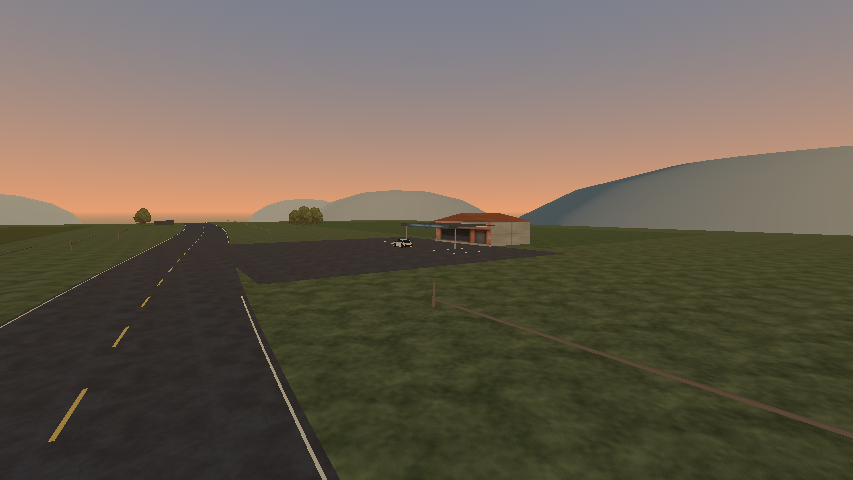

# Caminho da Serra — orientação e paradas

O percurso agora tem placas para Vila da Serra, Bairro do Sol, Parada da Serra e Praça da Vila. Os acessos da parada rural e do refúgio rodoviário receberam aberturas nas cercas e na pintura lateral. O refúgio ganhou ligação pavimentada à rodovia, cobertura, identificação comercial e vagas pintadas. Agrupamentos de árvores e campos com tons diferentes substituem o alinhamento regular, criando trechos abertos entre as massas.



## Comparações visuais

| Enquadramento | Antes | Depois |
| --- | --- | --- |
| Parada rural | [Imagem](before/rural/rural-stop.png) | [Imagem](after/rural/rural-stop.png) |
| Campo e curva | [Imagem](before/rural/rural-road.png) | [Imagem](after/rural/rural-road.png) |
| Refúgio da rodovia | [Imagem](before/highway/refuge.png) | [Imagem](after/highway/refuge.png) |
| Chegada à vila | [Imagem](before/town/village-sign.png) | [Imagem](after/town/village-sign.png) |

[Placa no campo](after/rural/rural-wayfinding.png) · [Aviso de parada](after/highway/stop-sign.png).

Prévias curtas em Econômico/854×480/Compatibility, R7 M260, mesmas câmeras por comparação. Células isoladas com céu/sol/horizonte da viagem; não são ensaios de streaming ou desempenho. As cenas anteriores usam cópias dos seus recursos compartilhados, preservando os materiais antigos. O carro é posicionado para ilustrar estrada/parada; não dirige nessas imagens.

Inspeção: o acesso pavimentado do refúgio ficou mais claro, a cobertura identifica o ponto de parada e os grupos de árvores interrompem menos a leitura da via. As placas nomeiam regiões e destinos. Legibilidade em movimento, direção humana e aprovação artística continuam pendentes. Campo/horizonte ainda são simples e o kit permanece provisório.

## Conteúdo

Uma textura nova: `assets/textures/intercity/wayfinding.png`, atlas opaco 512², glifos originais rasterizados offline com biblioteca padrão Python. Sem fontes externas ou `Label3D` durante o jogo. Import com compressão GPU e mipmaps. Origem e SHA-256 em `assets/textures/intercity/provenance.json`. A API do gerador antigo foi ampliada mantendo seu comportamento padrão; o atlas da Avenida do Vale foi conferido byte a byte e continua idêntico.

Geometria/materiais base reaproveitados. Sem novas luzes dinâmicas, efeitos ou managers. Mesma extensão, quatro células, apoio plano e até três residentes. `generator_version` passa a 3; o horizonte mantém a geometria anterior. A representação distante é regenerada a partir do conteúdo atual, mantendo simplificação de detalhe.

| Célula | Cards antes → depois | Colisores antes → depois | Lotes MultiMesh antes → depois |
| --- | ---: | ---: | ---: |
| Rural | 26 → 13 | 54 → 43 | 46 → 44 |
| Rodovia | 26 → 11 | 54 → 43 | 46 → 46 |
| Vila | 7 → 7 | 64 → 70 | 81 → 86 |

Inventários completos nos contextos das imagens. Contagens não são FPS ou draw calls medidos. Não houve benchmark nem alegação de ganho de desempenho; medições exigem janela combinada de uso exclusivo da máquina.

## Validação e builds

- `intercity.log`: 16 checks, zero falhas, incluindo regeneração equivalente, junções físicas, ida/volta, streaming, menu e reset.
- `route-access.log`: 15 checks, zero falhas. Condução real por inputs valida entrada/saída da praça, rua lateral, parada rural e refúgio, apoio e residência.
- Builds Linux/Windows atualizados. `pack-access.log`: 13 checks; `pack-stops.log`: 15 checks. Ambos sem falhas, usando o PCK Linux fora do projeto com harness Godot headless. Windows nativo permanece pendente.
- Atlas novo reproduzido a partir do gerador e atlas anterior conferido sem alteração. O runner completo não foi repetido.

Total desta revisão: **59 verificações funcionais**, em cenas de fonte e recursos exportados. Logs, contextos, hashes de código/cenas e builds ficam nesta pasta.

## Experimentar

Escolha **Viajar pelo Caminho da Serra** no menu. A parada rural fica à esquerda de quem sai da avenida; o refúgio fica à direita na rodovia. As duas entradas permitem sair da via e retornar. Continue pelas placas até a vila e sua praça. Não há tráfego ou atividades novos.

```sh
python3 scripts/tools/build_intercity_signs.py
godot --headless --path . --editor --quit
godot --headless --path . --script res://scripts/tools/build_intercity.gd
godot --headless --path . --fixed-fps 60 --script res://tests/town_access_smoke.gd
godot --path . --rendering-method gl_compatibility --script res://scripts/tools/build_town_previews.gd -- --region=highway --output=/tmp/wave-highway-views
```

Usar dados/configurações temporários nos ensaios. Prévias aceitam `--region=rural|highway|town`; padrão `town`. Autoria entra nos geradores/dados, pois regenerar sobrescreve cenas. Próximo passo: avaliação jogada do percurso e refino dos enquadramentos/acessos fracos, antes de expandir extensão ou introduzir relevo.
