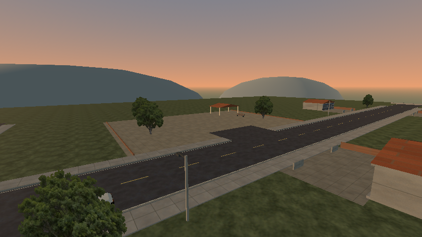

# Vila da Serra — primeira autoria do núcleo

Incremento localizado nos 400 m finais do Caminho da Serra. A vila ganha calçadas, cruzamento pintado, sete lotes assimétricos com pátios/muros baixos, três postes e uma praça com abrigo, bancos e árvores. A entrada da praça e a rua lateral ficam livres para dirigir. O objetivo é distinguir o destino do campo e dar um lugar para explorar, sem aumentar a extensão do mundo.



## Antes e depois

| Enquadramento | Antes | Depois |
| --- | --- | --- |
| Chegada pela avenida | [Imagem](before/approach.png) | [Imagem](after/approach.png) |
| Praça e acesso | [Imagem](before/square.png) | [Imagem](after/square.png) |
| Rua principal | [Imagem](before/main-street.png) | [Imagem](after/main-street.png) |

Prévias curtas com câmeras iguais, Econômico/854×480/Compatibility e R7 M260 confirmada nos contextos. O script desenha o detalhe da célula isolado, com céu/sol/horizonte da viagem; não avalia streaming, direção ou FPS. Não há captura de desempenho. A identidade final dos marcadores dos lotes foi corrigida depois das imagens; posições, malhas e materiais dessas vistas permaneceram iguais.

Inspeção: a calçada aproxima visualmente os lotes da via; implantação e fachadas variadas quebram a repetição; praça e cobertura dão um destino legível. Ainda há muito espaço vazio, fachadas reaproveitadas, árvores em cards e horizonte simples. Esta revisão não aprova qualidade artística, diversão ou meta MW2005.

## Conteúdo e contratos

Autoria entra no gerador offline e nos dados de `intercity_layout.gd`. Materiais, texturas e primitivas são os existentes. Os postes são geometria, sem novas luzes dinâmicas. A praça tem piso opaco e acessos planos. As calçadas usam colisores por trecho contínuo, separados nas aberturas; bancos, postes e muros têm colisões reais.

| Inventário da célula | Antes | Depois |
| --- | ---: | ---: |
| Filhos diretos | 89 | 118 |
| Lotes MultiMesh | 50 | 81 |
| Instâncias nesses lotes | 317 | 647 |
| Malhas de superfícies | 37 | 26 |
| Colisores | 36 | 64 |
| Cards de árvores | 26 | 7 |

Essas contagens são de conteúdo, não draw calls medidos ou prova de desempenho. O detalhe aumentou e precisa de medição futura numa janela exclusiva. O manifesto mantém quatro células e residência máxima de três; `generator_version` passa a 2. Os arquivos das células rural/rodoviária, horizonte e recursos compartilhados anteriores foram conferidos e preservados. O HLOD inclui piso da praça, rua lateral e cobertura, mantendo proxies simplificados.

## Validação

- `town-access.log`: sete checks de condução com inputs reais — entrada/saída da praça, rua lateral, apoio, ausência de bloqueios durante os acessos e limite de residência.
- `intercity.log`: 16 checks, zero falhas — regeneração equivalente das três células geradas, junções, viagem de ida/volta, menu, apoio e reset.
- `hlod.log`: 12 checks, zero falhas — suite existente de geometria/salvamento e transições do corredor; não substitui avaliação visual do HLOD da vila.
- Builds Linux/Windows reexportados. `pack-access.log` (13 checks) e `pack-town-access.log` (sete checks), ambos sem falhas, verificam menu/recursos e os novos acessos usando o PCK Linux fora do projeto. Windows nativo continua pendente.

O runner completo não foi repetido. Não houve benchmark, sessão longa ou alegação de melhora de FPS. A máquina pode estar sendo usada para outros jogos; novas medições ficam para uma janela combinada de uso exclusivo.

## Experimentar e regenerar

Abra `builds/linux/Wave.x86_64`, o executável Windows ou F5 no editor, e escolha **Viajar pelo Caminho da Serra**. A vila fica no fim do percurso. A praça está à esquerda de quem chega, depois do cruzamento; a rua lateral também permite sair da avenida.

```sh
godot --headless --path . --script res://scripts/tools/build_intercity.gd
godot --headless --path . --fixed-fps 60 --script res://tests/town_access_smoke.gd
godot --path . --rendering-method gl_compatibility --script res://scripts/tools/build_town_previews.gd
```

Use dados/configurações temporários nos ensaios. O gerador sobrescreve artefatos; editar a autoria nos scripts/dados. Prévias vão para `builds/previews/town`, ou `-- --output=/tmp/wave-town-views`. O script aceita `--cell=` para comparar uma célula anterior. `previous-builder.gd.txt`, `previous-cell-3.tscn.txt`, contextos e hashes preservam a revisão anterior e a identidade dos recursos finais.
