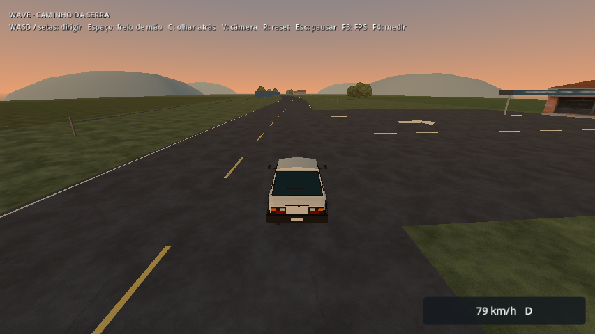

# Caminho da Serra — acessos vistos durante a condução

Revisão das aproximações às três paradas com o carro, HUD, streaming e ChaseCamera reais. A passada anterior mostrou que as placas são legíveis perto da entrada, mas a referência desaparece do enquadramento antes da manobra. Na rodovia, um intervalo de grama entre a curva e o piso retangular do refúgio interrompia visualmente a ligação pavimentada.

As entradas da parada rural, do refúgio e da praça agora têm limites e setas pintados no piso. O pavimento rural e o do refúgio acompanham as amostras da borda da estrada; a conexão não depende mais de um retângulo aproximando a curva. A primeira versão das setas parecia um traço pela perspectiva da câmera; a versão final amplia a pintura mantendo-a dentro dos acessos existentes.



## Comparações durante a viagem

| Aproximação | Antes | Depois |
| --- | --- | --- |
| Parada rural na ida, 20 m | [Imagem](before/outward-rural-20.png) | [Imagem](after/outward-rural-20.png) |
| Parada rural na volta, 20 m | [Imagem](before/return-rural-20.png) | [Imagem](after/return-rural-20.png) |
| Refúgio na ida, 20 m | [Imagem](before/outward-refuge-20.png) | [Imagem](after/outward-refuge-20.png) |
| Refúgio na volta, 20 m | [Imagem](before/return-refuge-20.png) | [Imagem](after/return-refuge-20.png) |
| Praça na ida, 20 m | [Imagem](before/outward-square-20.png) | [Imagem](after/outward-square-20.png) |
| Praça na volta, 20 m | [Imagem](before/return-square-20.png) | [Imagem](after/return-square-20.png) |
| Placa rural na ida, 45 m | [Imagem](before/outward-rural-45.png) | [Imagem](after/outward-rural-45.png) |

Econômico/854×480/Compatibility, R7 M260. Alvo de 80 km/h; velocidade efetiva, posição e FOV de cada captura estão nos contextos. As duas passadas usam os mesmos controles, câmera e gatilhos de distância, com condução contínua por inputs. São screenshots durante a viagem, não câmeras posicionadas depois de teleportar. O retorno começa com reset de posição/rumo no endpoint, fora das imagens; a aproximação da praça na volta inclui a aceleração inicial, portanto não equivale às demais em velocidade.

Cada passada produziu 18 imagens: 80/45/20 m antes de cada destino, nos dois sentidos. Uma seleção fica nesta pasta; a passada final completa foi copiada para `builds/previews/drive-approaches`. As distâncias são longitudinais até o centro do acesso; posições reais permitem conferir a ultrapassagem do gatilho. Captura de performance fica automaticamente desligada nesse modo. Não há conclusão de FPS, diversão humana ou aprovação de legibilidade.

## Conteúdo e física

Manifesto com `generator_version: 5`. A autoria altera dois pisos existentes e acrescenta seis faixas e três setas em malhas opacas. Texturas, materiais, iluminação, entradas, cercas, dimensões do mundo e colisores são preservados. As setas compartilham uma malha de três triângulos e o material de pintura existente; o HLOD mantém a ligação dos pisos e dispensa a pintura distante. Horizonte original preservado. A contagem física não aumenta; custo gráfico deve ser medido na janela exclusiva prevista no plano.

| Célula | Lotes MultiMesh antes → depois | Instâncias antes → depois | Triângulos das superfícies antes → depois | Colisores |
| --- | ---: | ---: | ---: | ---: |
| Rural | 56 → 57 | 323 → 326 | 376 → 386 | 47, idênticos |
| Rodovia | 54 → 55 | 324 → 327 | 352 → 372 | 45, idênticos |
| Vila | 95 → 96 | 667 → 670 | 390 → 390 | 72, idênticos |

`inventory.json` compara dimensões/transformações de todos os colisores com as células do commit anterior, além dessas contagens. Os triângulos da tabela excluem as instâncias MultiMesh. Lotes não são draw calls medidos.

A fixture `intercity_smoke.gd` agora dirige pela faixa direita nos dois sentidos, com offsets +3,5 m na ida e −3,5 m na volta. Antes usava +3,5 m em ambas as pernas. O identificador da rota de captura passa a `sol-serra-proof-v2` e registra as faixas; as séries históricas v1 continuam válidas sob suas condições, sem comparação direta de desempenho com a rota alterada.

## Validação

- `motion-before.log`: 14 checks e 18 capturas, zero falhas, cenário anterior com a fixture de revisão.
- `motion-after.log`: 14 checks e 18 capturas, zero falhas, versão final.
- `intercity.log`: 16 checks, zero falhas; regeneração, junções, ida/volta a 108 km/h na faixa correta, reset, menu e residência.
- `town-access.log`: 15 checks, zero falhas; entradas/saídas das paradas por inputs reais, contato físico e streaming.
- `map-ground-access.log`: 100 checks, zero falhas; transições de chão nos sete mapas além do rally.
- `pack-menu.log`: 13 checks, zero falhas; menu, recursos exportados, condução e célula remota.
- `pack-stops.log`: 15 checks, zero falhas; acessos usando o PCK e fixture externa.

**173 verificações funcionais da revisão, mais 14 da comparação anterior**, sem falhas. O runner completo de 585 checks não foi repetido. Builds Linux/Windows atualizados; PCKs com SHA-256 idêntico, registrado em `identities.json`. Windows nativo, teclado/gamepad humano, frenagem para entrar e avaliação de diversão continuam pendentes. O carro não entra nas paradas nas passadas de screenshots; esse comportamento é coberto separadamente pela suíte de acessos.

Uma tentativa intermediária produziu os 14 checks e as 18 imagens, mas o processo encerrou com SIGTERM (143) após registrar os resultados. `motion-interrupted.log` preserva essa tentativa; ela não é a referência de conclusão. A rodada final foi repetida separadamente, com encerramento normal, e seus resultados estão em `motion-after.log`.

## Reproduzir e avaliar

```sh
# Pasta XDG nova para manter as preferências pessoais.
DRI_PRIME=1 XDG_DATA_HOME=/tmp/wave-drive-review-new godot --path . --rendering-method gl_compatibility --script res://tests/intercity_smoke.gd -- --driving-previews --review-speed-kmh=80
# --balanced usa Equilibrado/720p; velocidades aceitas: 60 a 120 km/h.
```

Abra **Viajar pelo Caminho da Serra** no menu e confira a sequência placa → pintura → entrada. A próxima avaliação humana deve reduzir, entrar e retornar das três paradas, nos dois sentidos. O objetivo é verificar se a orientação permite decidir a tempo e se o carro/câmera ajudam durante a manobra; a fixture automatizada não certifica isso.
