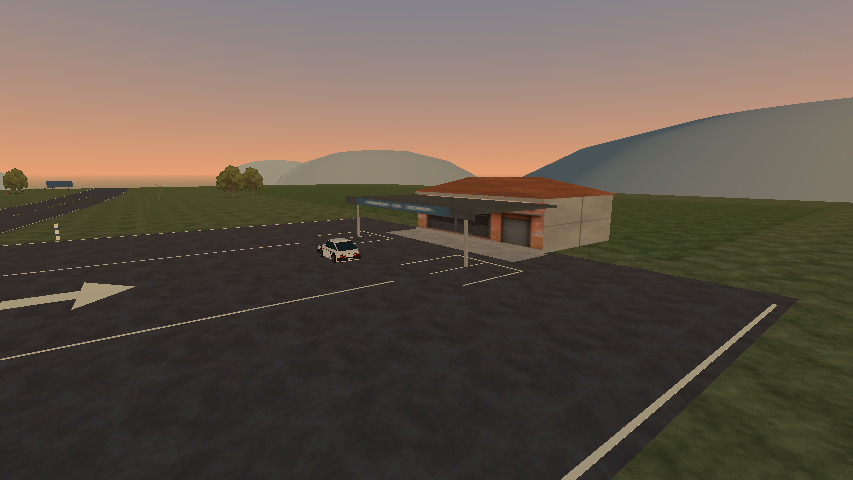

# Caminho da Serra — frentes das paradas

Refino localizado da parada rural e do refúgio rodoviário. Nas capturas anteriores, o aviso já saía do enquadramento perto da entrada e os pátios se confundiam com uma extensão aberta do piso. A pintura de acesso continua; esta revisão acrescenta referências nos limites e organiza o espaço para parar e manobrar.

As duas paradas recebem balizadores claros com faixas azuis e pintura nas extremidades do pátio. Cada uma tem quatro vagas de 5 × 3 m, abertas para a estrada, com um corredor central de 9 m. No refúgio, uma faixa de concreto diferencia o espaço junto ao abrigo. Os materiais e as texturas são os existentes; a montagem continua offline.



## Comparações visuais

| Enquadramento | Antes | Depois |
| --- | --- | --- |
| Pátio rural, câmera fixa | [Imagem](before/rural-parking.png) | [Imagem](after/rural-parking.png) |
| Pátio do refúgio, câmera fixa | [Imagem](before/refuge-parking.png) | [Imagem](after/refuge-parking.png) |
| Parada rural na ida, 20 m | [Imagem](before/outward-rural-20.png) | [Imagem](after/outward-rural-20.png) |
| Parada rural na volta, 20 m | [Imagem](before/return-rural-20.png) | [Imagem](after/return-rural-20.png) |
| Refúgio na ida, 20 m | [Imagem](before/outward-refuge-20.png) | [Imagem](after/outward-refuge-20.png) |
| Refúgio na volta, 20 m | [Imagem](before/return-refuge-20.png) | [Imagem](after/return-refuge-20.png) |

As imagens em movimento usam ChaseCamera/HUD/streaming reais, faixa direita nos dois sentidos e alvo de 80 km/h, no Econômico/854×480/Compatibility da R7 M260. A versão anterior é a do commit `146227d`; a final usa as mesmas entradas e gatilhos de distância. Os contextos [antes](before/context.json) e [depois](after/context.json) registram velocidade, posição e FOV efetivos. Cada passada concluiu 14 checks e 18 capturas; a seleção inclui também imagens a 80 m. A sequência final completa está em `builds/previews/drive-approaches`.

As duas vistas dos pátios são câmeras fixas de detalhe, acrescentadas à ferramenta `build_town_previews.gd`. Comparam as células anteriores preservadas com as atuais, sob o mesmo céu/luz/preset; seus contextos são separados das capturas de condução. Nenhuma destas imagens certifica FPS ou avaliação humana.

## Manobras e posicionamento

A nova fixture `tests/stop_maneuver_smoke.gd` visita a parada rural, o refúgio e a praça nos dois sentidos. Cada caso começa 90 m antes do destino com velocidade inicial de 80 km/h, freia, faz a curva para o acesso, para com freio de mão e volta à faixa original. Depois do posicionamento inicial, não há teleporte nem alteração direta de rumo/velocidade: a fixture usa os inputs do veículo. O controlador do teste acompanha uma linha de aproximação e curvas amostradas; não é uma função nova do jogo.

O teste revelou interferência dos primeiros balizadores na saída. A posição final fica um metro além das extremidades do pátio e a 12 m do centro amostrado da estrada, com colisão real. O piloto da fixture também foi corrigido: perseguir cada ponto pequeno da curva isoladamente fazia o carro circular ao redor de pontos já ultrapassados. Agora ele busca um ponto adiante na linha, limita o desvio a 3 m e exige proximidade do destino final.

As seis manobras passaram com apoio contínuo, sem novos bloqueios de streaming e com até três células residentes. A velocidade efetiva no início da curva ficou entre 14,9 e 22,1 km/h; os valores e as posições de parada/saída estão em [stop-maneuver.log](stop-maneuver.log). O teste cobre o corredor de circulação, não estacionamento em todas as vagas. Ele não aprova sensação, legibilidade humana ou uma aproximação sem frenagem.

## Conteúdo e custo

Manifesto com `generator_version: 6`. O inventário compara as formas e transformações dos colisores como conjuntos com multiplicidade, sem depender da numeração dos nós. Os colisores existentes são preservados; entram somente quatro balizadores. O relevo, a física do carro, as placas e os acessos permanecem os mesmos. Vila, horizonte e HLOD conservam os artefatos anteriores: os novos detalhes são próximos e não alteram a representação distante.

| Célula | Lotes MultiMesh antes → depois | Instâncias antes → depois | Triângulos das superfícies antes → depois | Colisores antes → depois |
| --- | ---: | ---: | ---: | ---: |
| Rural | 57 → 58 | 326 → 342 | 386 → 386 | 47 → 49 |
| Rodovia | 55 → 57 | 327 → 339 | 372 → 374 | 45 → 47 |
| Vila | 96 → 96 | 670 → 670 | 390 → 390 | 72 → 72 |

[Inventário comparativo](inventory.json), [antes](inventory-before.json), [depois](inventory-after.json) e [script de coleta](inventory.gd). Triângulos de superfície excluem as instâncias MultiMesh; lotes não são draw calls medidos. Não há conclusão de desempenho. Benchmarks Intel/Radeon e sessão longa aguardam a janela exclusiva prevista no plano.

## Validação e builds

- [check-project.log](check-project.log): suíte completa, **604 checks de comportamento e 10 testes Python**, zero falhas, incluindo regeneração offline dos mapas antigos. Os erros de carga durante `streaming_smoke.gd` são injeções intencionais de falha cobertas pelos checks. [Contagens por suite](validation.json).
- [stop-maneuver.log](stop-maneuver.log): 19 checks, zero falhas, nas seis manobras por inputs.
- [motion-before.log](motion-before.log) e [motion-after.log](motion-after.log): 14 checks e 18 capturas em cada passada, zero falhas e encerramento normal.
- [exported-access.log](exported-access.log): 174 checks funcionais no PCK (40 rally, 100 transições de chão, 15 acessos e 19 manobras), zero falhas, mais a guarda de uso exclusivo do pacote exportado.
- [pack-menu.log](pack-menu.log): 13 checks, zero falhas; menu, condução e apoio da célula remota. O processo registrou aviso de seis instâncias ObjectDB no encerramento; este resultado não é uma prova de ausência de vazamento.
- [linux-launch.log](linux-launch.log): executável Linux exportado inicia e encerra normalmente em headless; este smoke não avalia a apresentação gráfica.

Builds locais Linux/Windows atualizados. Os PCKs têm SHA-256 idêntico; [identities.json](identities.json) identifica os pacotes, gerador, fixture e células. O runner completo incorpora a nova fixture, e o runner de acesso exportado usa cópias externas das duas suites de paradas, com preferências isoladas.

## Reproduzir

```sh
# GODOT_BIN deve apontar para o executável Godot 4.7.2.
GODOT_BIN=/caminho/do/godot bash scripts/tools/check_project.sh
GODOT_BIN=/caminho/do/godot bash scripts/tools/check_exported_access.sh

# Nova pasta para não alterar preferências pessoais. Captura sem benchmark.
DRI_PRIME=1 XDG_DATA_HOME=/tmp/wave-stop-review-new godot --path . --rendering-method gl_compatibility --script res://tests/intercity_smoke.gd -- --driving-previews --review-speed-kmh=80
```

Para avaliar jogando, abra **Viajar pelo Caminho da Serra**, reduza antes das entradas e confira pintura → limites → espaço para parar. Entre e saia das duas paradas nos dois sentidos; compare também com o acesso à praça. Avaliação humana de direção/câmera/áudio, aprovação artística, Windows nativo e requisitos de hardware continuam pendentes.
