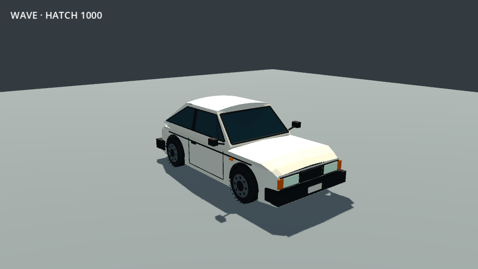
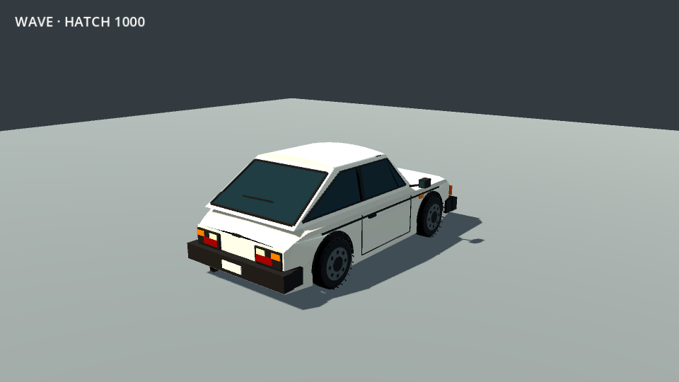
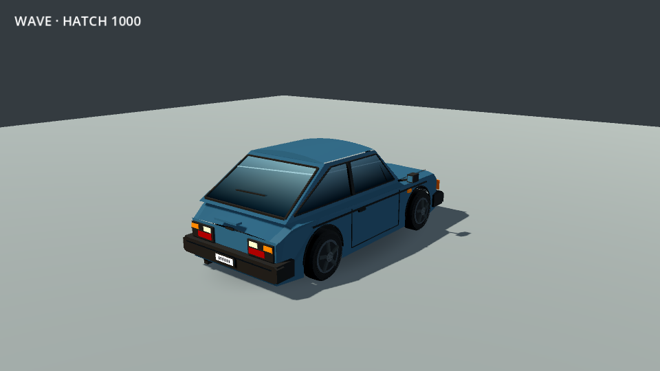
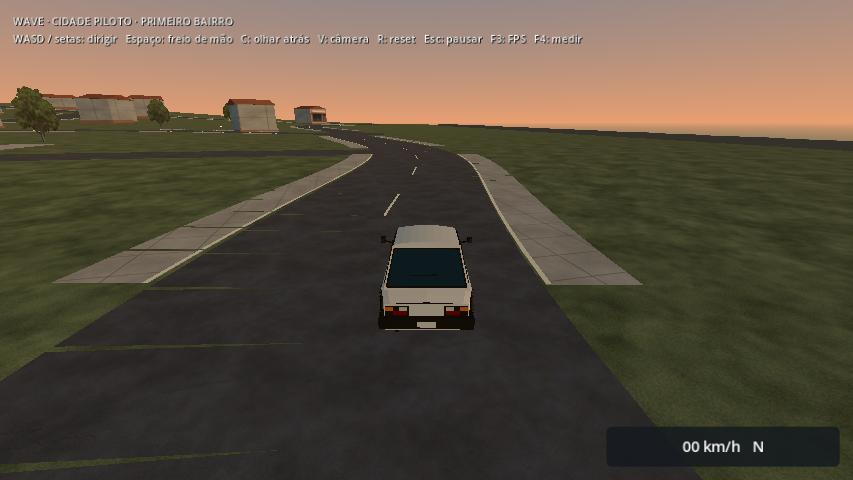
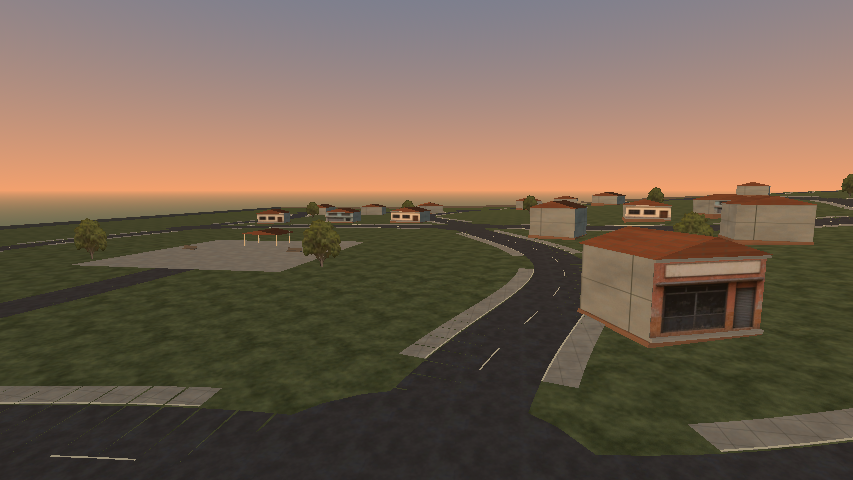
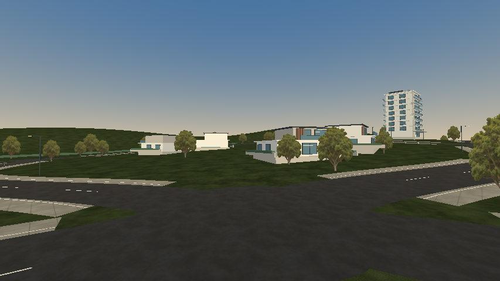
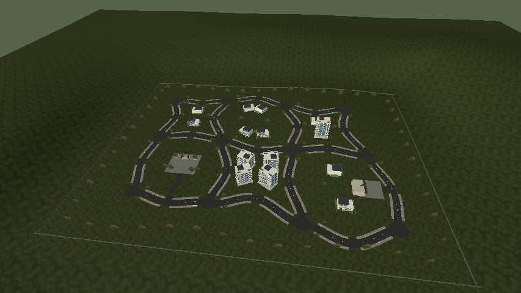

# Jardins do Vale — calçadas, bairro e veículo

2026-10-08. Primeira etapa da revisão solicitada: resolver o esbarramento nas calçadas e aumentar o acabamento deste bairro, sobretudo do veículo, com direção visual de bairro de classe alta. **Continuam sendo seis quarteirões conectados**; a expansão para quinze e as cidades definitivas vêm depois da consolidação deste lugar. “400%” representa a ambição visual, sem uma medida objetiva de qualidade.

## Calçadas e implantação

A borda de 12 cm passou a ter um chanfro de 60 cm, retorno externo suave e transições nas aberturas. As faixas da malha usam tangentes compartilhadas nas curvas, evitando frestas entre segmentos. Piso visível e colisão usam a mesma geometria. A física de direção, frenagem e aderência foi preservada.

Em duas travessias a **36 km/h**, com simulação fixa em 60 Hz, o maior salto de altura do corpo relativo ao terreno caiu de **6,27 cm para 2,53 cm por quadro**, redução de **59,6%** neste ensaio. A velocidade mínima permaneceu acima de 99% da velocidade de aproximação. São medidas funcionais de passagem pela guia; não são FPS nem avaliação humana de sensação. Dados em `curb-comparison.json` e `curb-results.json`.

A fixture cobre 18 passagens em quatro ruas curvas, entre parte baixa e encosta: frente, ré em diagonal, entrada/saída dos dois lados e velocidade urbana. **56 verificações passaram**. O teste anterior atravessava a guia sem travar completamente, mas apresentava um salto maior; não foi reproduzido um travamento em todas as situações relatadas.

A implantação inicial dos novos volumes também revelou um prédio próximo demais da curva e uma parede de jardim invadindo a passagem lateral. Esses casos foram corrigidos antes da entrega. O gerador verifica o envelope dos lotes em relação às ruas curvas, e a fixture confere centro e duas faixas de cada rua a cada amostra de 2 m. Nos quarteirões estreitos, menos construções deixam espaço para jardim e circulação. Um lote sem afastamento suficiente impede o salvamento do mapa.

## Veículo

O Hatch 1000 recebeu pintura azul metálica com brilho controlado, normais mais suaves no capô/teto, vidros com gradiente contínuo, rodas de cinco raios, pneus e aros revisados, para-choques chanfrados, detalhes dos faróis, grade, placas e painéis. Uma sombra de contato simples acompanha o piso e desaparece no ar, permitindo ancoragem visual também no Econômico. Ela não projeta sombras dinâmicas nem acrescenta luzes ao cenário.

Dimensões de colisão, entre-eixos, raio físico das rodas e controlador arcade permanecem. Os materiais e meshes são gerados offline; não há reconstrução durante a partida. Os vidros são opacos, com reflexão estilizada, para manter custo e ordenação simples.

| Antes | Depois |
| --- | --- |
|  |  |
|  |  |

As imagens do carro usam as mesmas câmeras e luzes do estúdio, em 960×640/MSAA 2×. São vistas estáticas; não medem desempenho.

## Bairro

Nove sobrados contemporâneos, cinco prédios residenciais e a oficina substituem a implantação provisória. Fachadas claras, caixilhos, vidro, varandas, brises de madeira, coberturas, jardins e muros baixos dão profundidade e identidade. A praça recebeu canteiros, bancos e um pavilhão; as ruas têm árvores e postes. O relevo dirigível permanece, com cerca de 13,5 m de desnível entre ruas. Um terreno contínuo no entorno substitui os morros em volumes isolados; o entorno é visual e fica além dos limites físicos do bairro.

A indexação das superfícies reduziu os vértices únicos de **128.958 para 26.249**, mantendo exatamente as posições dos triângulos e todas as colisões (`mesh-inventory.json`). O arquivo da cidade caiu de 7,7 para 3,8 MB. A regeneração final passou mais três verificações.

Os detalhes usam materiais compartilhados e lotes espaciais de 112 m para reduzir submissões de desenho. Árvores usam a folhagem já existente em impostores; superfícies foscas e árvores usam iluminação por vértice, enquanto carro e vidro preservam o brilho. Não foram adicionadas luzes locais, pós-processamento caro ou dependência de Forward+.

| Antes | Depois |
| --- | --- |
|  |  |
|  |  |
|  |  |



As vistas do bairro usam Econômico/854×480 na R7 M260. `driving-spawn.png` usa câmera real e HUD. As demais usam câmeras fixas, sem neblina e sem culling por distância para revisão do conjunto. O contexto está em `after/context.json`.

## Verificação e limites

A validação direcionada no projeto passou **183 checks**: cidade 32, calçadas do bairro 56, direção 33, navegação em terreno/guias 33 e menu 29. A mesma fixture da cidade confere regeneração, apoio, seis circuitos por inputs, praça/oficina, reset, câmera, pausa e retorno ao menu. `drive-final.log`, `curb-final.log`, `check-car.log` e os JSONs registram os resultados. A suite completa anterior permanece como evidência histórica da primeira versão.

O pacote final passou **260 verificações de acesso** (incluindo cidade 30 e calçadas 56), mais a guarda de identidade do PCK. O menu exportado passou 17. O executável Linux iniciou sem erros; o build Windows foi gerado, mas não executado nativamente. Os PCKs Linux/Windows têm o mesmo SHA-256, registrado em `artifact-hashes.json`. Evidências: `export-access.log`, `export-menu.log`, `export-launch.log`, `export-city-results.json` e `export-curb-results.json`.

A arte ainda exige revisão humana em movimento, principalmente proporção, variedade e acabamento próximo do veículo e dos lotes. Garagens e prédios não têm interiores jogáveis; não há tráfego ou atividade nova. A próxima etapa concentra o acabamento neste mesmo bairro antes de aumentar a área.

Os testes funcionais não comprovam FPS. As medições renderizadas usam a mesma volta do centro, alvo de 30 km/h e cinco segundos de aquecimento. GPU, preset, janela, foco, resolução lógica, frame times e monitores são registrados no JSON e nos CSVs. São passagens locais curtas, sem isolamento térmico/uso exclusivo, não certificação de 8 GB, Windows nativo ou sessão longa. Avisos históricos ObjectDB e avisos GL em algumas fixtures de diagnóstico ao encerrar permanecem registrados; ausência de vazamento não foi comprovada.

## Medições renderizadas

A primeira versão visual apresentou picos maiores na Intel. A indexação das malhas corrigiu esse custo sem remover conteúdo. Dados das tentativas anteriores ficam em `performance/intel-before-indexing`; os resultados abaixo usam a versão indexada.

| Condição | Média FPS | P95 (ms) | P99 (ms) | 1% low FPS |
| --- | ---: | ---: | ---: | ---: |
| HD 4400 · Econômico · bairro anterior | 44,5 | 33,48 | 36,98 | 25,6 |
| HD 4400 · Econômico · bairro revisado/indexado | 42,2 | 34,92 | 37,73 | 24,9 |
| R7 M260 · Médio · bairro revisado/indexado | 59,4 | 19,54 | 22,83 | 37,5 |

A volta foi concluída com apoio e pavimento em todas as amostras na versão atual. O ganho visual custou aproximadamente 5% de média nesta comparação local; a cauda ficou próxima da versão anterior após a correção. O 1% low abaixo de 30 FPS mantém aberta a meta de desempenho sustentado na Intel; não declarar certificação de 30 FPS com base na média.

A passagem final na Radeon em Médio concluiu a mesma volta com apoio/pavimento em todas as amostras. Seus dados estão em `performance/radeon-indexed-medium`. As pastas `radeon-after-medium` e `radeon-after-economy` registram tentativas anteriores à indexação.

## Reproduzir

```sh
GODOT_BIN=~/Downloads/Apps/Godot_v4.7.2-stable_linux.x86_64 bash scripts/tools/check_project.sh
GODOT_BIN=~/Downloads/Apps/Godot_v4.7.2-stable_linux.x86_64 bash scripts/tools/check_exported_access.sh
DRI_PRIME=0 XDG_DATA_HOME=/tmp/wave-pilot-economy godot --path . --script res://tests/pilot_city_rendered.gd -- --economy
DRI_PRIME=1 XDG_DATA_HOME=/tmp/wave-pilot-medium godot --path . --script res://tests/pilot_city_rendered.gd
```

Para comparar com a versão anterior, acrescentar `--baseline-dir=docs/art-results/2026-10-08/jardins-do-vale/baseline-resources` depois de `--`.

Rodar as medições gráficas uma por vez, sem `--headless` ou `--fixed-fps`. Confirmar a GPU no JSON; a seleção automática desta instalação prefere a Radeon. O aviso Mesa sobre `DRI_PRIME=0` não impediu a seleção Intel, que foi conferida no log. Preferências do usuário permanecem isoladas das fixtures.
