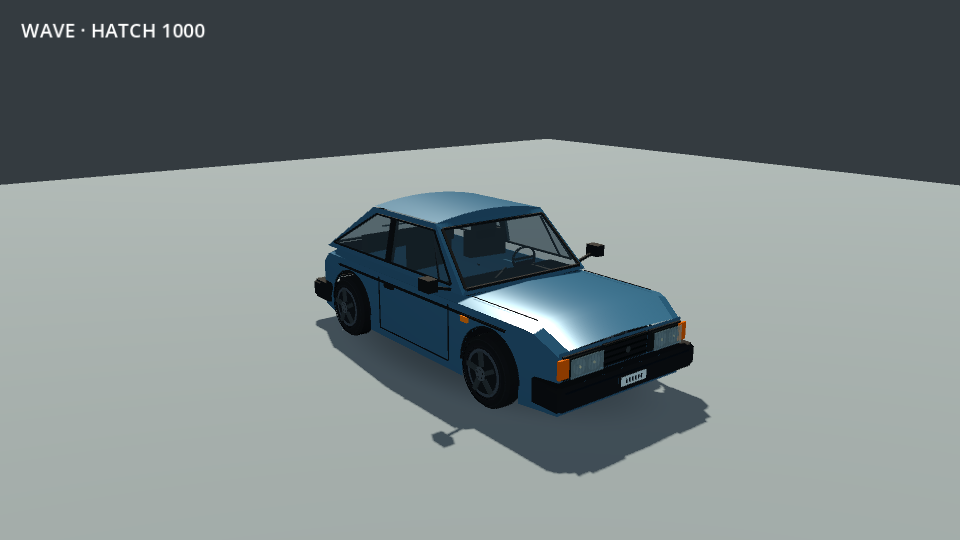
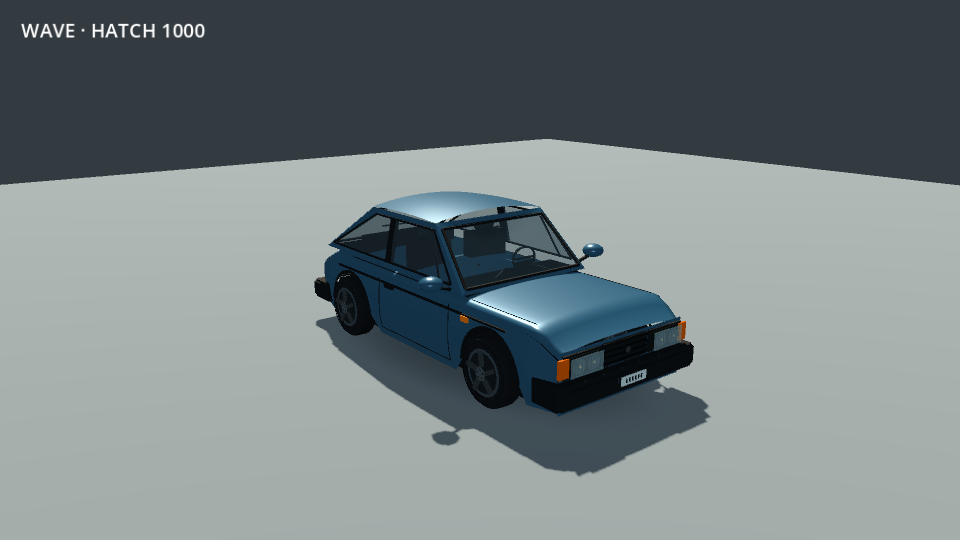
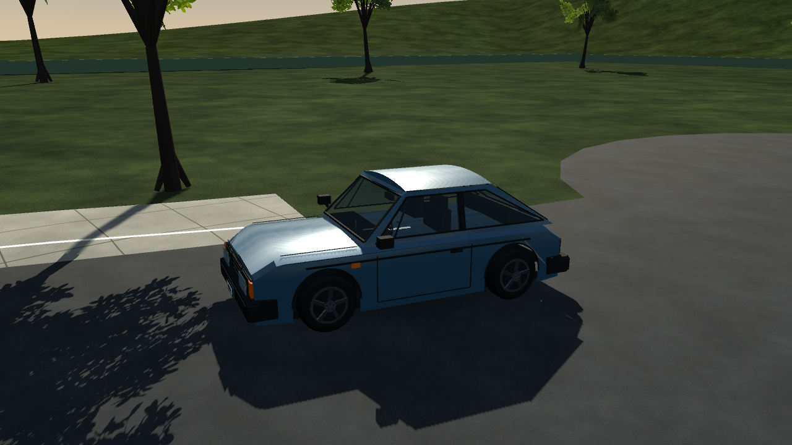
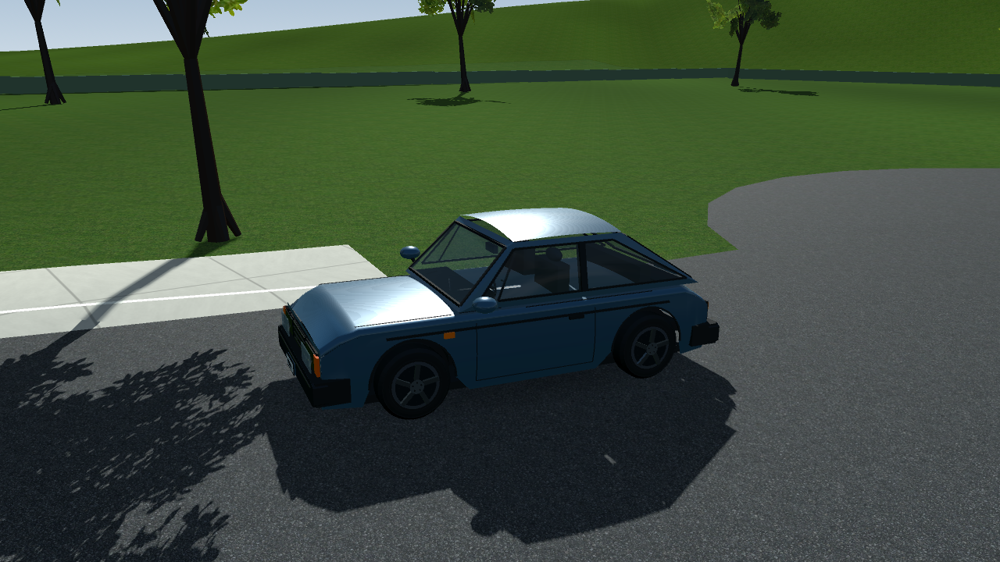
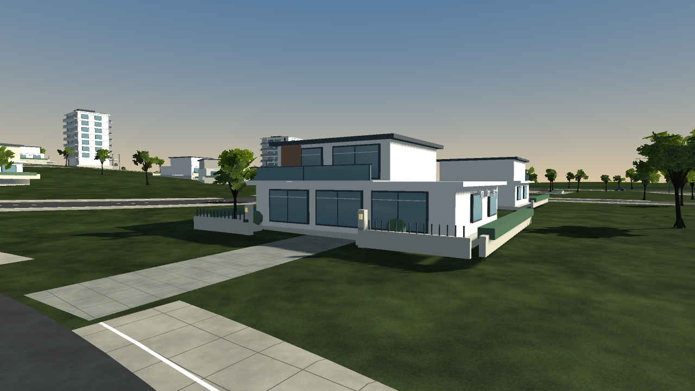
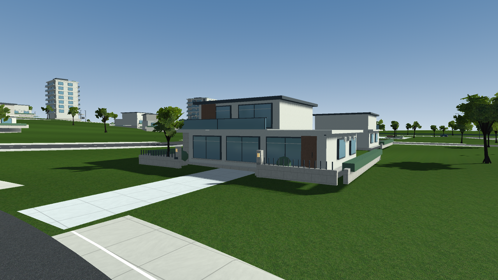
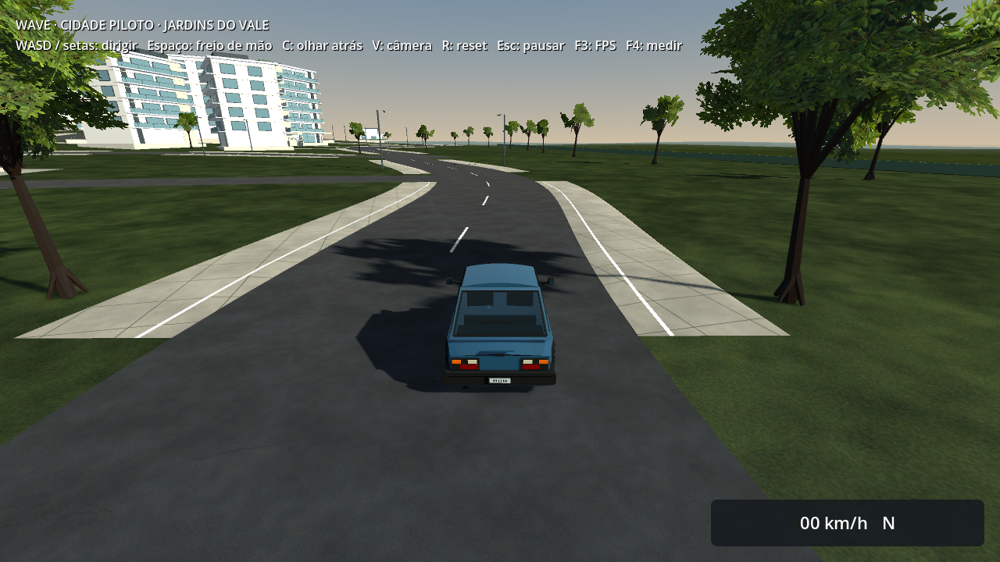
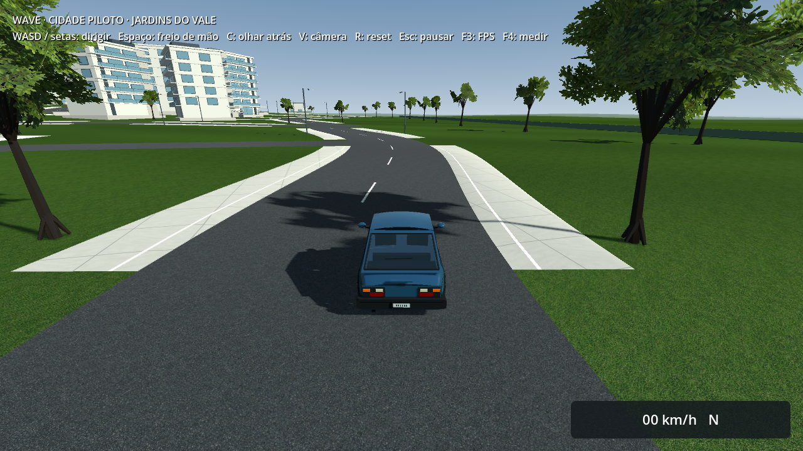

# Jardins do Vale · carroceria e materiais · direção visual MW 2012

A referência visual atual é **Most Wanted 2012**, conforme o pedido mais recente. Esta entrega melhora o bairro existente e principalmente o Hatch 1000; mantém seis quarteirões, nove sobrados, cinco prédios, 107 árvores volumétricas, o mesmo controlador arcade, suporte, relevo e colisões. Não amplia o mapa nem inicia cidades reais.

É um incremento concreto de modelagem e materiais. **Não equivale ao acabamento de MW 2012**, e “500%” não é uma métrica de qualidade certificada. Ainda faltam densidade/composição urbana, variedade de fachadas, interiores convincentes e acabamento próximo antes de tratar este bairro como referência final.

## Carro

Carroceria construída por seções curvas, com ombros arredondados, laterais abauladas, recortes de rodas e teto arqueado em duas direções. As normais acompanham a geometria; foram retiradas as normais artificiais dos antigos painéis planos. Retrovisores, assentos e apoios de cabeça têm volume arredondado; vidros subdivididos têm curvatura e mostram a cabine. Linhas de portas/capô acompanham a nova superfície. Caixas de roda recebem forros escuros, pneus passam de 24 para 48 segmentos e os freios têm discos/perfurações.

Pintura preserva verniz e reflexos locais no perfil Equilibrado, com rugosidade e metalicidade revistas. Uma primeira versão de 15.636 triângulos na carroceria foi reduzida a **10.308**, removendo seções longitudinais redundantes e um mapa de micro-relevo pouco perceptível. Rodas: **2.700 triângulos por roda**; carro completo: **21.108**, frente aos 11.848 da etapa anterior. A quantidade de triângulos não mede realismo. Tudo é gerado offline, sem geração de geometria durante a condução.

| Antes | Depois |
| --- | --- |
|  |  |
|  |  |

As vistas de estúdio usam a mesma iluminação/câmera da etapa anterior. As vistas na rua incluem a revisão de luz e superfícies.

## Bairro

Asfalto com grãos e desgaste em duas escalas, gramado com textura original de grama cortada, reboco, pedra com juntas, madeira com veios e pavimento com painéis. As superfícies arquitetônicas usam projeção em escala mundial para evitar esticar texturas sobre paredes de tamanhos diferentes. Portas, puxadores, peitoris, faixas de pedra e arremates acrescentam profundidade às casas. Luz e horizonte ficam mais neutros; as áreas pavimentadas têm luminosidade ajustada.

O Econômico mantém modelos/texturas e iluminação por vértice nas superfícies arquitetônicas; Equilibrado/Qualidade acrescentam mapas normais por pixel e o probe local já existente. Nenhuma dependência de Forward+ foi introduzida. Guias chanfradas, transições e suporte continuam com a mesma geometria funcional.

| Antes | Depois |
| --- | --- |
|  |  |
|  |  |

[Vista geral](after/overview.png), [encosta](after/hill.png), [Econômico na câmera de condução](economy/driving-spawn.png) e [estúdio em quatro ângulos](car/hatch-1000.png). Apenas `driving-spawn` mantém câmera/HUD/neblina/culling de jogo; as vistas de inspeção desligam neblina e distância de visibilidade. Os arquivos `context.json` registram GPU, resolução e câmeras. Capturas estáticas não são benchmarks nem aprovação humana.

## Assets e reprodução

Texturas originais geradas pelo **imagegen integrado**, em modo geração, sem imagens de entrada. Fontes preservadas no projeto; importação de 512 px com mipmaps e compressão VRAM. Caminhos finais e prompts exatos:

- [Asfalto: fonte e prompt](../../../../assets/textures/neighborhood/asphalt-realism-v1.md), consumido de `assets/textures/neighborhood/asphalt-realism-v1.png`.
- [Gramado: fonte e prompt](../../../../assets/textures/neighborhood/lawn-realism-v1.md), consumido de `assets/textures/neighborhood/lawn-realism-v1.png`.

Reboco, pedra, madeira e pavimento são materiais procedurais originais, determinísticos, gerados por `scripts/tools/build_neighborhood_materials.gd` e salvos como ImageTexture com mipmaps. Não contêm assets extraídos dos jogos de referência. A foto em `references` permanece uma referência de acabamento; não substitui o modelo nem entra no pacote.

```sh
# Usar GODOT_BIN apontando para Godot 4.7.2.
"$GODOT_BIN" --headless --path . --script scripts/tools/build_neighborhood_materials.gd
"$GODOT_BIN" --headless --path . --editor --quit
"$GODOT_BIN" --headless --path . --script scripts/tools/build_hatch_car.gd
"$GODOT_BIN" --headless --path . --script scripts/tools/build_pilot_city.gd
```

O gerador de capturas do bairro agora restaura as preferências gráficas ao terminar. Isso foi conferido comparando o arquivo de configurações antes/depois de uma execução renderizada em diretório isolado.

## Validação

202 verificações funcionais direcionadas passaram antes da otimização final exclusivamente visual: cidade 32, guias 56, direção 33, navegação 33, menu 29 e captura/configurações 19. A regeneração determinística foi repetida no acabamento final: mais 3 verificações. O **PCK final** passou cidade 30, guias 56 e menu/acessos 17, total **103**, seguido de mais 17 no menu com renderização real. Startup do executável Linux também passou. [Resumo de escopo](validation-summary.json) e [hashes dos artefatos](artifact-hashes.json).

O runner completo do projeto não foi repetido nesta etapa. Windows foi exportado e tem PCK idêntico ao Linux; não houve execução nativa no Windows. Fixtures de geração continuam emitindo os seis avisos ObjectDB já observados anteriormente; esta entrega não certifica ausência de leaks.

## Desempenho

| Condição | FPS médio | P95 (ms) | P99 (ms) | 1% baixo (FPS) |
| --- | ---: | ---: | ---: | ---: |
| Intel HD 4400 · Econômico · antes | 35.7 | 39.51 | 45.80 | 19.6 |
| Intel HD 4400 · Econômico · final | 34.7 | 39.45 | 47.75 | 19.2 |
| Radeon R7 M260 · Equilibrado · final | 50.3 | 24.93 | 27.34 | 34.4 |

Na comparação Intel desta sessão, a média caiu aproximadamente **2,8%**, com P95 praticamente igual. Há quedas abaixo de 30 FPS tanto antes quanto depois; **a meta de 30 FPS sustentados na Intel continua aberta**. Na Radeon, o 1% baixo ficou acima de 30 nesta rota curta. Todas as rotas medidas chegaram ao destino com suporte e permanência no pavimento de 100%. O primeiro incremento ainda não otimizado marcou 34,0 FPS na Intel e está arquivado como `attempt-1-intel`, não como resultado final.

Perfil Econômico: janela/captura 854×480; Equilibrado: 1280×720, sombras e MSAA 2×. O viewport lógico reportado é 1280×720 nos dois casos, devido a `canvas_items`; os JSONs mantêm ambos os tamanhos. Medições feitas no editor/runtime debug a partir do source, não no executável release. [Resumo das medições](performance-summary.json); CSVs, frame times, contexto e logs estão em `performance/`.

O diagnóstico de baseline emitiu duas mensagens de erro de textura GL de 349.524 bytes no encerramento. Não apareceram durante os percursos nem nos logs da versão final/pacote. Os logs foram preservados; esta medição não comprova ausência de leaks.

São diagnósticos curtos (~99 segundos de rota, após cinco segundos de aquecimento), uma passagem por condição, em máquina compartilhada com 16 GB. Os testes funcionais e exports terminaram antes das medições, que foram sequenciais. Não equivalem a três passagens, sessão longa ou certificação de 30 FPS sustentados/8 GB. O baseline Intel preserva a sombra de contato e a configuração de reflexão da etapa imediatamente anterior, usando `--baseline-current-grade`; os snapshots estão em `baseline-resources`.
