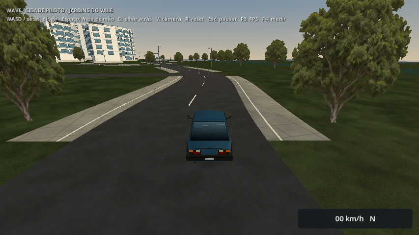
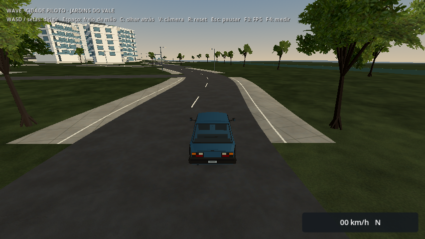
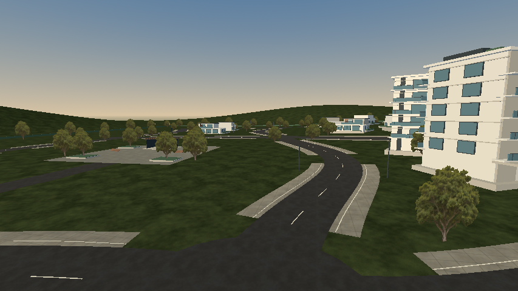
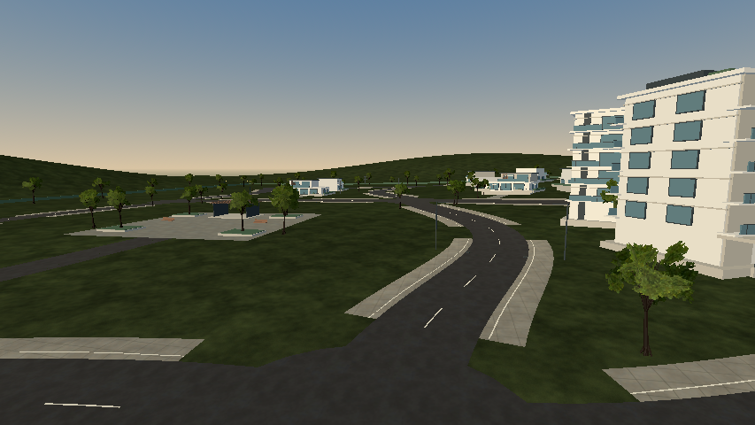
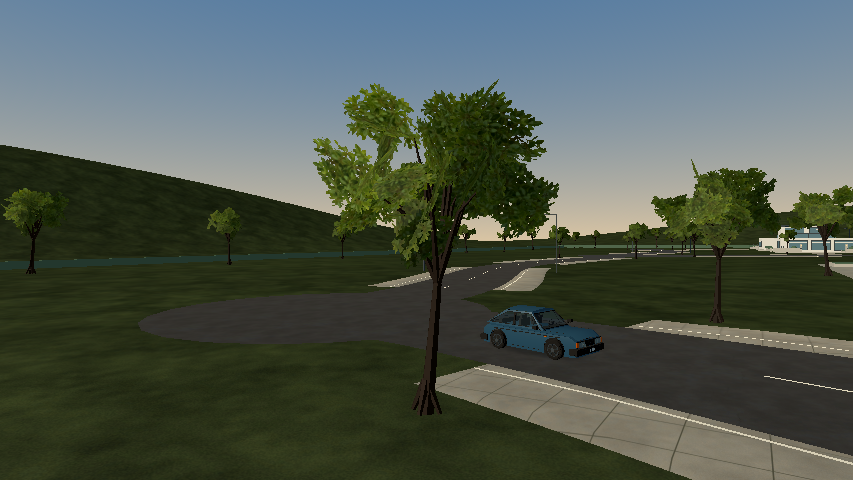
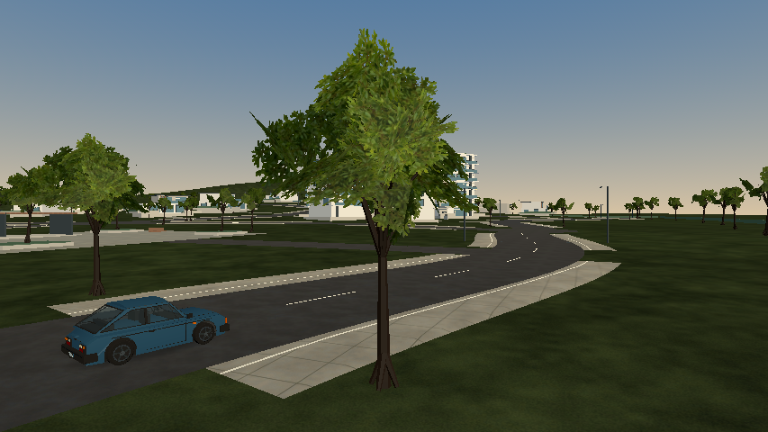
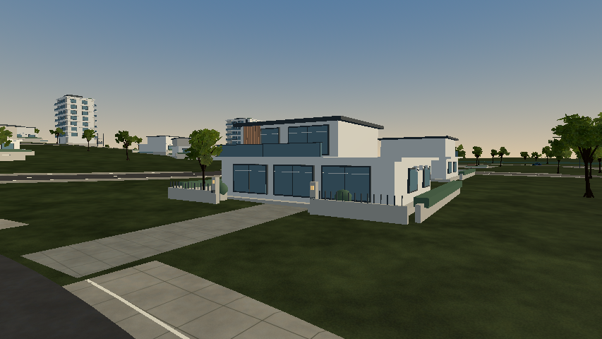
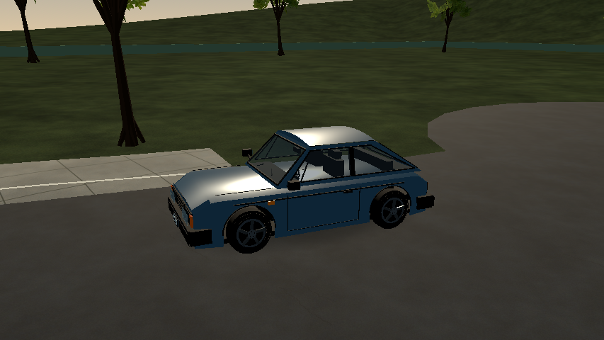
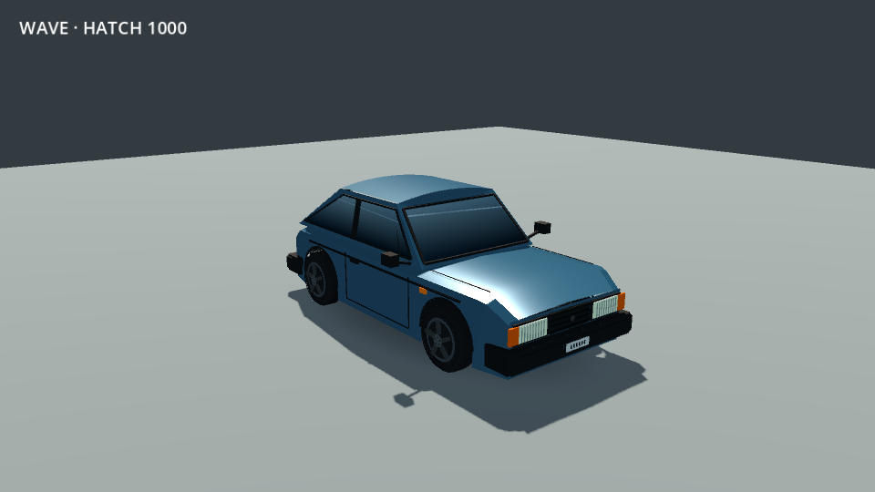
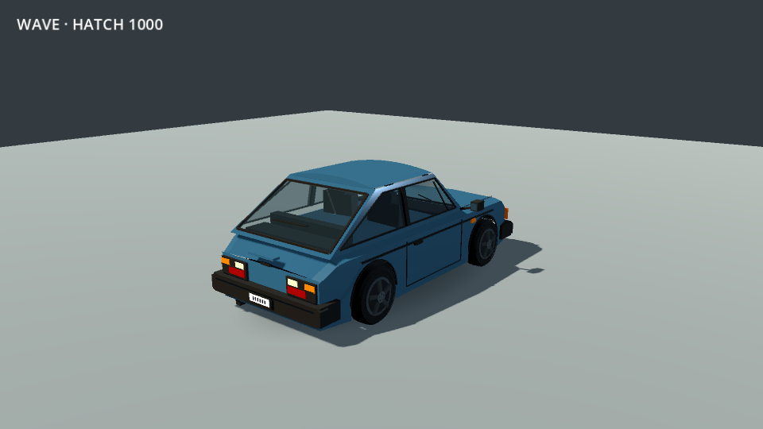

# Jardins do Vale — árvores em volume e realismo

2026-10-08. Revisão do mesmo bairro de seis quarteirões, a partir da avaliação do usuário e da referência em `references/realism/Pasted image.png`. A imagem orienta materiais, profundidade e acabamento; o veículo continua sendo o Hatch 1000 original. Não há mudança de controlador, dimensões de colisão, raio físico das rodas ou traçado.

## Árvores

As 107 árvores do bairro usam troncos, raízes e bifurcações modelados, com ramos de folhagem distribuídos em posições e orientações tridimensionais. A copa não gira para acompanhar a câmera. A textura representa pequenos ramos, não uma árvore inteira: folhas e galhos finos se sobrepõem em camadas fixas dentro de uma copa com volume. São patches chanfrados com recorte alfa, técnica de folhagem com custo controlado; as folhas individuais não são sólidos fechados.

A árvore-base tem 324 triângulos de tronco/galhos e 264 de folhagem próxima. Os LODs de folhagem usam 176 e 88 triângulos. Variações de escala nos dois eixos horizontais, altura e rotação evitam o mesmo contorno em todos os exemplares. A geometria é compartilhada em MultiMeshes espaciais e gerada offline, com sementes fixas. Os limites de culling incluem o volume real, sem dependência de billboard. O envelope físico anterior de cada tronco foi preservado.

Foi criada uma textura original com a skill **imagegen**, usando a ferramenta integrada, preservando a transparência da fonte. Arquivo: [leaf-cluster-v1.png](../../../../assets/textures/neighborhood/leaf-cluster-v1.png). [Prompt integral e procedência](../../../../assets/textures/neighborhood/leaf-cluster-v1.md). O importador Godot produz a versão de 512 px com mipmaps e compressão de VRAM. A fotografia antiga continua disponível para os laboratórios anteriores.

| Antes | Depois |
| --- | --- |
|  |  |
|  |  |




## Bairro

As casas e os prédios receberam acessos pavimentados até as ruas, portões e gradis, iluminação de entrada sem luzes dinâmicas novas, caixas de correio e numeração. Os sobrados têm vasos e equipamentos de fachada; as ruas receberam grelhas de drenagem junto às guias. O gramado varia suavemente a cor com a posição, sem shader novo de terreno. Todas as novas peças de entrada são decorativas; a implantação mantém a faixa de circulação e as calçadas chanfradas da revisão anterior.

Pavimentos de entrada e números são agregados em malhas compartilhadas, evitando uma chamada por casa e por texto. A numeração é geometria nativa de fonte, salva na cena, sem renderização de texto durante a condução.



## Hatch 1000

As janelas agora são aberturas reais na carroceria, com vidros transmissivos e cabine modelada: bancos, encostos, painel, volante, console e acabamento interno. O gradiente opaco e a faixa de reflexão pintada deram lugar ao vidro e à iluminação do ambiente. A pintura ganhou verniz e normais mais suaves nas laterais. Os faróis têm refletores e lentes sobrepostas; pneus receberam sulcos. As rodas permanecem ligadas à direção e ao giro existentes.

São 2.776 triângulos na carroceria e 2.268 por roda, total de 11.848 no conjunto, mais dois da sombra de contato. A transparência se concentra nos vidros e nas lentes; folhas usam recorte alfa. Ainda é um modelo estilizado com volumes simples, distante do realismo da referência. Não há personagem motorista, interior interativo ou animação de entrada.

Um ReflectionProbe estático captura o cenário uma vez nos perfis com MSAA (Médio/Qualidade). Econômico e Legacy mantêm reflexos do céu, evitando o custo local. O atlas foi limitado a quatro capturas de 128 px, em vez dos defaults de 64×256; o projeto usa apenas uma. Não há atualização contínua, SSR ou dependência de Forward+.



| Antes no estúdio | Depois no mesmo estúdio |
| --- | --- |
|  |  |
|  |  |

As capturas `after` usam Econômico, com câmera real/HUD no início. As demais vistas são estáticas, sem neblina e sem culling por distância, para revisão do conjunto. A pasta `medium` registra separadamente o perfil Médio, com sombras, MSAA e reflexos locais. As imagens do estúdio mantêm as mesmas câmeras/luzes de antes e MSAA 2×. Capturas estáticas não comprovam FPS.

## Desempenho e validação

| Condição | Média FPS | P95 (ms) | P99 (ms) | 1% low FPS |
| --- | ---: | ---: | ---: | ---: |
| HD 4400 · Econômico · anterior | 42.1 | 35.24 | 37.82 | 25.2 |
| HD 4400 · Econômico · revisão final | 35.8 | 39.16 | 42.20 | 22.8 |
| R7 M260 · Médio · revisão final | 52.5 | 23.46 | 26.01 | 35.3 |

As duas voltas finais foram concluídas com apoio e pavimento em todas as amostras. A média na Intel ficou 14,9% abaixo da passagem anterior feita nesta revisão; o 1% low caiu de 25,2 para 22,8 FPS. O detalhe acrescido tem custo, apesar das otimizações. A Radeon ficou em 52,5 FPS, com 1% low de 35,3 FPS. Comparada apenas como contexto com os 59,4 FPS da revisão anterior, essa passagem foi cerca de 12% mais lenta; essa referência Radeon foi medida na etapa anterior, não repetida nesta sessão.

`performance/intel-before-economy`, `intel-after-economy` e `radeon-after-medium` são os resultados de comparação final. `attempt-*` contém versões descartadas. As passagens renderizadas usam a mesma volta pelo centro, alvo de 30 km/h, cinco segundos de aquecimento, VSync/limite de FPS desligados e preferências isoladas. São diagnósticos locais curtos em Linux, com 16 GB e sem isolamento térmico/uso exclusivo; não certificam 8 GB, Windows nativo ou desempenho sustentado.

As primeiras tentativas ficaram mais lentas na Intel e foram revistas antes da entrega. O registro das tentativas anteriores fica separado dos resultados finais. Reduzimos camadas sobrepostas, malhas redundantes, chamadas de texto/pavimento e memória do atlas; os reflexos locais foram reservados aos perfis com MSAA.

A validação no projeto passou **202 verificações**: cidade 32, calçadas 56, direção 33, navegação 33, menu 29 e ferramentas/configurações de captura 19. A regeneração agora compara também as malhas instanciadas das árvores e seus LODs, além de terreno, pavimento, transformações e colisões. Logs `source-*`, `city-results.json` e `curb-results.json` registram os resultados. A revisão de assets confirmou o volume tridimensional, ausência de billboards nas árvores e alfa na textura (`asset-review.json`); essa inspeção é da fonte, não uma fixture do export.

O pacote final passou **103 verificações direcionadas**: cidade 30, calçadas 56 e menu 17. A guarda do pacote confirmou a textura de folhagem no PCK e a exclusão das referências de trabalho. As 17 verificações do menu também passaram com uma janela renderizada na Radeon, carregando o bairro e os destinos anteriores; esse ensaio usa `--fixed-fps` e não mede FPS. O executável Linux iniciou sem erros. O build Windows foi gerado, mas não executado nativamente. Os PCKs dos dois sistemas têm SHA-256 idêntico, registrado em `artifact-hashes.json`. Logs `pack-*` e os JSONs `export-*` documentam a passagem. As fixtures externas usadas estão em `export-fixtures`; os testes do projeto continuam fora do pacote. A suite completa de acessos legados e o runner completo não foram repetidos nesta revisão visual; seus resultados anteriores permanecem históricos.

A meta de 30 FPS sustentados na Intel continua aberta. Ausência de vazamentos não foi certificada: avisos ObjectDB históricos ao encerrar fixtures ficam preservados nos logs. O bairro ainda exige avaliação humana em movimento. Prédios e garagens permanecem sem interiores jogáveis; não foi acrescentado tráfego.

## Reproduzir

```sh
GODOT_BIN=~/Downloads/Apps/Godot_v4.7.2-stable_linux.x86_64 bash scripts/tools/check_project.sh
GODOT_BIN=~/Downloads/Apps/Godot_v4.7.2-stable_linux.x86_64 bash scripts/tools/check_exported_access.sh
DRI_PRIME=0 XDG_DATA_HOME=/tmp/wave-realism-intel godot --path . --script res://tests/pilot_city_rendered.gd -- --economy
DRI_PRIME=1 XDG_DATA_HOME=/tmp/wave-realism-radeon godot --path . --script res://tests/pilot_city_rendered.gd
```

Para a comparação anterior, acrescentar `--baseline-dir=res://docs/art-results/2026-10-08/jardins-realismo/baseline-resources` depois de `--`. Rodar medições gráficas uma por vez, sem headless/fixed FPS. Conferir a GPU no JSON; a seleção automática desta instalação prefere a Radeon. O aviso Mesa sobre `DRI_PRIME=0` não impediu a seleção Intel, conferida no log. As tentativas nesta revisão usam o mesmo renderer Compatibility.
