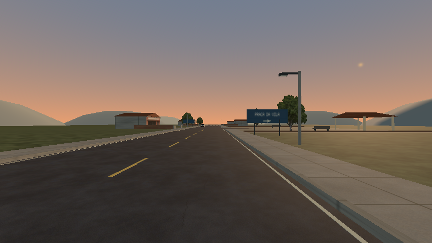

# Caminho da Serra — entradas indicadas nos dois sentidos

Refino localizado da orientação para as paradas existentes. As placas anteriores nomeavam destinos, mas não indicavam a manobra. A praça e o refúgio não tinham aviso de entrada na volta; a parada rural não tinha aviso próprio de aproximação.

As placas agora têm painéis maiores e setas opacas. Vila da Serra e Bairro do Sol indicam seguir em frente. Parada rural, refúgio e praça recebem avisos nos dois sentidos, com a seta correspondente ao lado da entrada visto pelo motorista. A placa da praça para quem chega ficou no lado direito da via. Na volta da rodovia, o aviso geral do Bairro do Sol foi afastado para não encobrir o aviso do refúgio.



## Comparações

| Vista | Antes | Depois |
| --- | --- | --- |
| Entrada da vila | [Imagem](before/town/village-sign.png) | [Imagem](after/town/village-sign.png) |
| Praça na ida | [Imagem](before/town/square-approach.png) | [Imagem](after/town/square-approach.png) |
| Praça na volta | [Imagem](before/town/square-return.png) | [Imagem](after/town/square-return.png) |
| Parada rural na ida | [Imagem](before/rural/stop-approach.png) | [Imagem](after/rural/stop-approach.png) |
| Refúgio na volta | [Imagem](before/highway/stop-return.png) | [Imagem](after/highway/stop-return.png) |

Câmeras iguais por comparação, Econômico/854×480/Compatibility, R7 M260 confirmada nos contextos. As vistas da praça e das paradas usam altura de 1,8 m para aproximar a leitura da condução. A comparação da rodovia usa uma cópia da célula anterior e de seus materiais compartilhados. Céu, sol e geometria do horizonte são os mesmos. As prévias mostram o detalhe isolado das células, sem streaming ou captura de FPS. Não substituem avaliação em movimento.

## Conteúdo e custo

Autoria em `scripts/world/intercity_builder.gd`; manifesto com `generator_version: 4`. As setas são três malhas planas de nove vértices cada, geradas offline, agrupadas por MultiMesh e usando o material de pintura existente. O atlas e as fachadas comerciais permanecem iguais. Os painéis não têm colisão; os postes continuam obstáculos físicos fora dos acessos.

| Célula | Lotes MultiMesh antes → depois | Instâncias antes → depois | Colisores antes → depois |
| --- | ---: | ---: | ---: |
| Rural | 44 → 56 | 311 → 323 | 43 → 47 |
| Rodovia | 46 → 54 | 317 → 324 | 43 → 45 |
| Vila | 86 → 95 | 659 → 667 | 70 → 72 |

Mesmo percurso, quatro células, piso plano, até três residentes e mesmas entradas. Não há novas texturas, luzes, atividades ou extensão territorial. O HLOD foi regenerado; o horizonte original foi preservado porque a regeneração só alterava os IDs dos nós. Inventários não são draw calls medidos nem aprovação de desempenho. O custo dos novos lotes exige medição futura na janela exclusiva prevista no plano.

## Validação

- `intercity.log`: 16 checks, zero falhas. Regeneração equivalente, junções, menu, viagem completa de ida/volta, apoio, reset e residência.
- `town-access.log`: 15 checks, zero falhas. Entradas/saídas da praça, rua lateral, parada rural e refúgio com inputs reais.
- `map-ground-access.log`: 100 checks, zero falhas. Transições de chão nos sete mapas além do rally, incluindo as regiões da viagem.
- `pack-menu.log`: 13 checks, zero falhas. Menu, manifestos, condução e célula remota usando recursos exportados.
- `pack-stops.log`: 15 checks, zero falhas. Os mesmos acessos das paradas no PCK, com fixture externa e preferências isoladas.

Total: **159 checks funcionais**, sem falhas. O runner completo de 585 checks não foi repetido nesta alteração localizada. O harness de menu exportado registrou aviso de seis instâncias ObjectDB no encerramento; os checks de acesso passaram. Builds Linux/Windows reexportados, com PCKs de SHA-256 idêntico; hashes em `identities.json`. Windows nativo e aprovação humana da condução/legibilidade continuam pendentes. Sem benchmark ou alegação de ganho de FPS.

## Experimentar

Escolha **Viajar pelo Caminho da Serra**. Na ida, a parada rural fica à esquerda, o refúgio à direita e a praça da vila à esquerda. Na volta, siga os novos avisos: praça à direita, refúgio à esquerda e parada rural à direita.

```sh
godot --headless --path . --script res://scripts/tools/build_intercity.gd
godot --headless --path . --fixed-fps 60 --script res://tests/intercity_smoke.gd
godot --headless --path . --fixed-fps 60 --script res://tests/town_access_smoke.gd
godot --path . --rendering-method gl_compatibility --script res://scripts/tools/build_town_previews.gd -- --region=town --output=/tmp/wave-town-views
```

Usar preferências temporárias nos ensaios. Prévias também aceitam `--region=rural|highway` e `--cell=` para uma cópia anterior. Próxima avaliação: ler os avisos em movimento e entrar/retornar das três paradas, especialmente na volta; refinar enquadramentos antes de ampliar o mapa.
