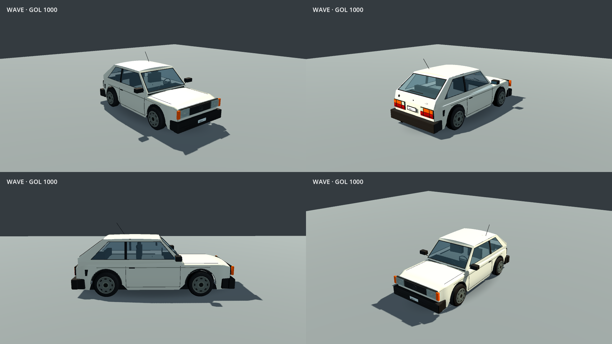

# Gol 1000 quadrado — 9 de outubro de 2026

Modelo feito no projeto a partir de fotografias do [Gol 1000 de 1993 da Garage84](https://garage84.com.br/comprar/vw-volkswagen/gol-1000-1993/31), usado como referência de forma, conjunto óptico, retrovisores e rodas. As fotografias permanecem no site de origem; não são distribuídas como assets.

A revisão troca a pintura por branco, alonga o teto, reduz a inclinação da tampa traseira, corrige os recortes das portas e remove a divisão de quebra-vento. A frente recebe grade larga, emblema VW, faróis retangulares com refletor individual e piscas âmbar. A traseira ganha lanternas com vermelho embaixo, âmbar e ré em cima, placa entre as lanternas e identificação Gol 1000. Rodas de aço com oito recessos e quatro parafusos substituem as rodas esportivas; retrovisores e para-choques usam plástico preto.

[Comparação interativa](compare.html) · [Antes](before/hatch-1000.png) · [Depois](after/hatch-1000.png) · [Carro no bairro](city/car-rear.png) · [Passeio no build](package-driving.png)

A geometria continua estilizada: esta etapa aproxima o carro do exemplar fotografado, sem representar uma réplica industrial medida. Colisão, eixos, raio dos pneus e parâmetros de condução permanecem os mesmos. A redução anterior de 60% na aceleração continua aplicada. O identificador interno `hatch-1000` e os nomes dos materiais permanecem compatíveis com o controlador, as luzes e os carros estacionados.

Corpo: 15.166 triângulos em oito superfícies; cada roda: 4.592 triângulos em três superfícies. Os recursos são gerados offline por `build_hatch_car.gd`. O bairro foi regenerado para atualizar os veículos estacionados. Capturas de estúdio mantêm câmera, iluminação e resolução do antes; as capturas do bairro usam o preset Equilibrado. Estas imagens verificam aparência; não medem FPS.

[Validação e builds](../../../development-results/2026-10-09/gol-1000/README.md).
