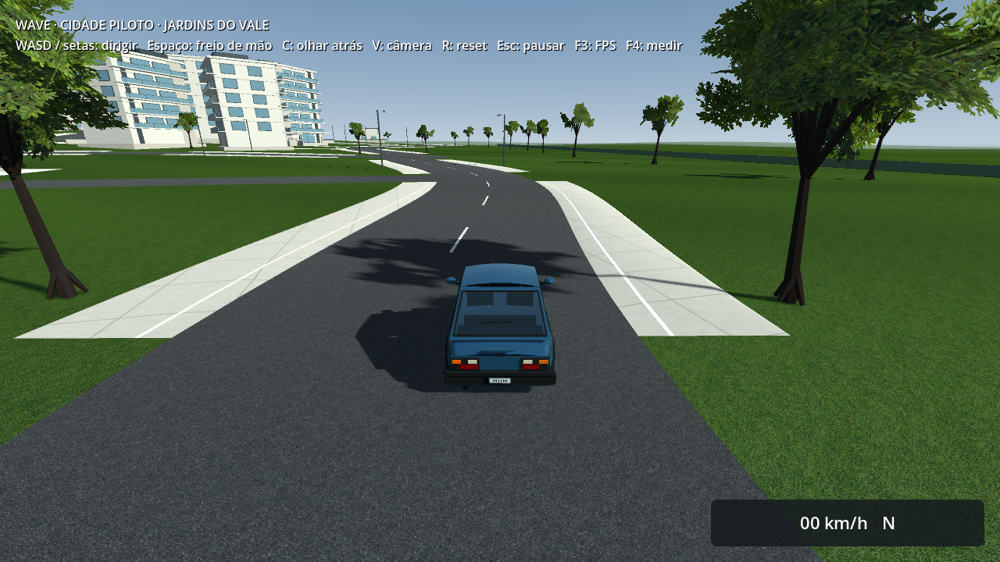
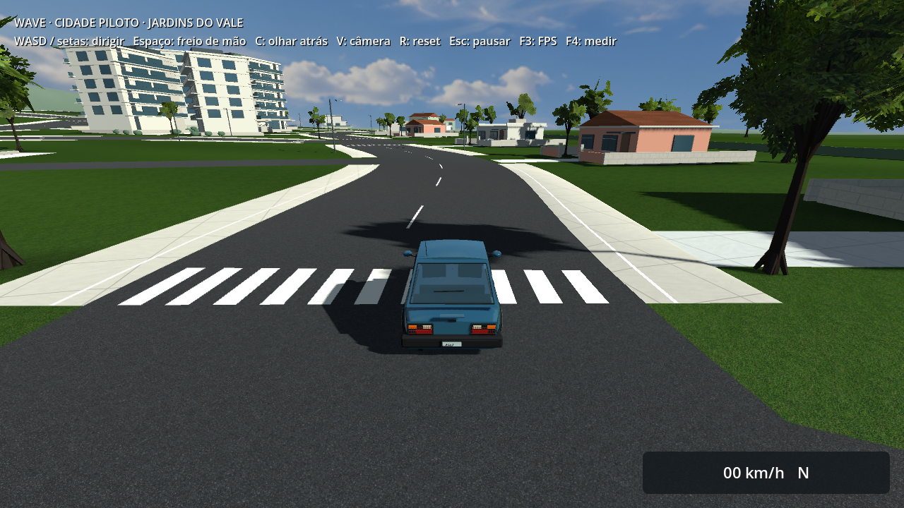
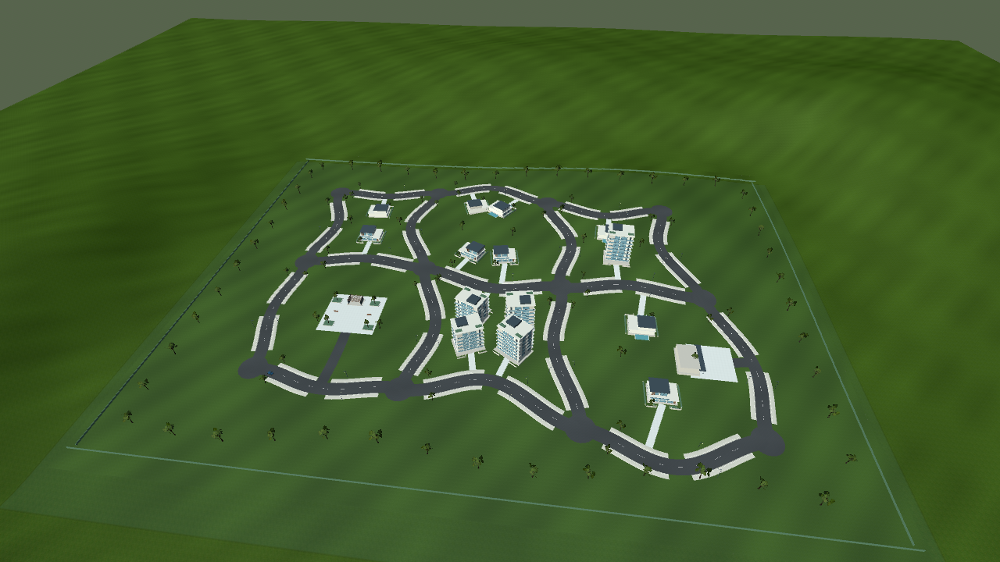
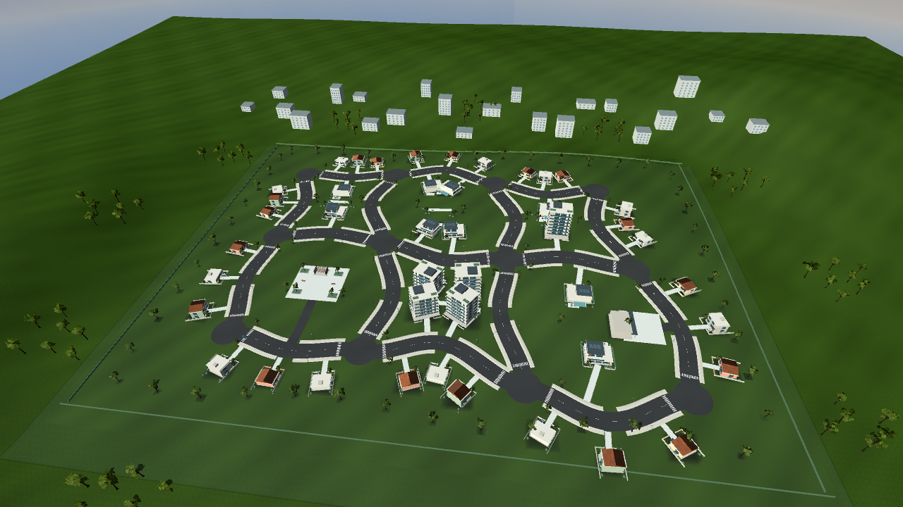
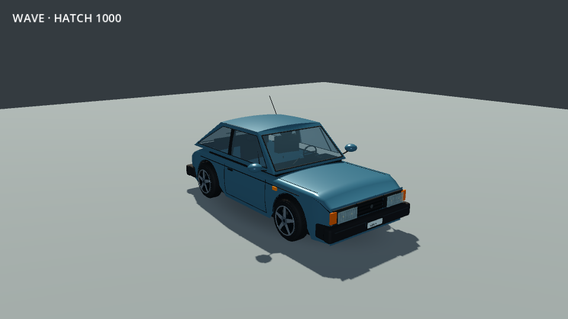

# Jardins do Vale — densidade, ruas e veículo

Revisão de 2026-10-09 para o pedido de um bairro mais preenchido, orgânico, com ruas mais largas e um salto gráfico, especialmente no veículo. A intenção de “500%” orienta a ambição; as capturas permitem avaliar o resultado, sem transformar qualidade artística em percentual certificado.

[Comparação interativa antes/depois](compare.html). Para dirigir: abrir o build, escolher **Dirigir na cidade piloto** e usar **Equilibrado · 720p** em Gráficos para ver sombras, mapas normais e reflexos locais. O Econômico conserva a mesma geometria, texturas, céu e luzes do carro.

| Elemento | Antes | Agora |
| --- | --- | --- |
| Quarteirões conectados | 6 | 6 |
| Ruas | 17, com 8–10 m | 17, com 11,5–14 m |
| Imóveis próximos | 15: nove sobrados, cinco prédios e oficina | 45: os anteriores e 30 casas nas frentes externas |
| Árvores volumétricas | 107 | 229, com três geometrias e grupos no entorno |
| Carros estacionados | 0 | 21, nas propriedades |
| Céu | Gradiente procedural | Panorama original com nuvens, também nos reflexos |
| Hatch completo | 21.108 triângulos | 31.564: carroceria 13.900 e quatro rodas de 4.416 |

Os 22 volumes de prédios distantes compõem o horizonte além da área jogável e não contam como novos quarteirões ou imóveis dirigíveis. A quantidade de polígonos não mede qualidade visual e acrescenta custo a conferir no benchmark combinado.

## Bairro

As frentes externas das ruas passam a ter casas térreas/sobrados, telhados inclinados e planos, cores variadas, entradas, pequenos jardins e árvores. O interior recebe jardins compartilhados, caminhos, bancos, vegetação e acabamento dos lotes. Os sobrados ganham arremates de telhado, calhas e painéis; a oficina, a praça e seus corredores de acesso permanecem reconhecíveis. O entorno troca parte do vazio por conjuntos irregulares de árvores e massas arquitetônicas distantes.

A avenida central tem 14 m, os outros trechos horizontais 12 m e os transversais 11,5 m. Cruzamentos acompanham a nova largura. Calçadas continuam com chanfros/transições; faixas de pedestres e pintura acompanham os planos do pavimento. A sombra de contato em fundações/árvores acompanha os triângulos exatos do terreno e entra em uma malha compartilhada, inclusive no Econômico. Cenário, colisões, malhas e texturas são salvos offline; não há geração de bairro durante o jogo.

## Veículo

Pintura azul com resposta revista, verniz e reflexos do novo céu. Ombros e teto recebem correção de superfície; o teto fica fechado nas bordas curvas. Para-choques e puxadores são arredondados, frisos/borrachas ficam mais finos, vidros curvos mostram a cabine, lentes recebem arremates, placa **WAV-1000** tem letras geométricas e a antena acrescenta escala.

As rodas têm cinco raios abertos, aro arredondado, disco/pinça visíveis, parafusos e ombros de pneu com normais contínuas. A geometria do aro foi reduzida na primeira iteração para conter o custo. Lanternas de freio respondem aos pedais, inclusive ao frear em ré; as brancas acendem em movimento para trás e apagam no reset. Materiais são independentes por carro, evitando acender carros estacionados junto com o jogador. Dimensões de colisão, posição dos eixos e a aceleração reduzida em 60% permanecem preservadas.

## Capturas

| Antes | Depois |
| --- | --- |
|  |  |
|  |  |
|  |  |

[Residência](after/residence.png), [carro na rua](after/car-street.png), [traseira](after/car-rear.png), [freio acionado](after/car-braking.png), [perfil Econômico](economy/driving-spawn.png), [condução com recursos do PCK final](package-driving.png) e [estúdio em quatro ângulos](after/car/hatch-1000.png).

Capturas antes/depois no Equilibrado, Radeon R7 M260, Compatibility e 1280×720; estúdio tem luz/câmera próprias iguais nas duas capturas. Somente a vista `driving-spawn` conserva câmera/HUD/neblina/culling de jogo. As vistas de inspeção desligam neblina/culling para mostrar o conjunto. `context.json` registra as condições. São inspeções estáticas, não evidência de FPS ou de aprovação jogada.

## Asset original e reprodução

O [céu](../../../../assets/textures/neighborhood/afternoon-sky-v1.png) foi criado pelo **imagegen integrado**, modo geração, sem imagens de entrada, com a [skill imagegen](/home/otavio/.codex/skills/.system/imagegen/SKILL.md). O [registro de origem e prompt exato](../../../../assets/textures/neighborhood/afternoon-sky-v1.provenance.json) preserva a especificação e o caminho de origem. Panorama LDR de 1774×887, usado como gerado, com mipmaps. Não é uma captura HDR medida nem contém assets extraídos de jogos.

```sh
# GODOT_BIN aponta para Godot 4.7.2.
"$GODOT_BIN" --headless --path . --editor --quit
"$GODOT_BIN" --headless --path . --script scripts/tools/build_hatch_car.gd
"$GODOT_BIN" --headless --path . --script scripts/tools/build_pilot_city.gd
DRI_PRIME=1 "$GODOT_BIN" --path . --script scripts/tools/build_pilot_city_previews.gd -- --medium --output=res://builds/previews/pilot-city
```

As capturas usam preferências isoladas e o gerador restaura o preset ao terminar. Builds e validação final são registrados no [relatório funcional](../../../development-results/2026-10-09/neighborhood-refresh/README.md).

## Limites

A referência continua sendo Most Wanted 2012, sem alegação de equivalência visual. A densidade e o detalhamento acrescentam custo; nenhuma nova medição de FPS foi feita nesta tarefa. A janela combinada de uso exclusivo, os gates de 30 FPS sustentados/8 GB e a avaliação jogada continuam pendentes. Windows é exportado nesta máquina Linux e precisa de execução nativa no Windows.
