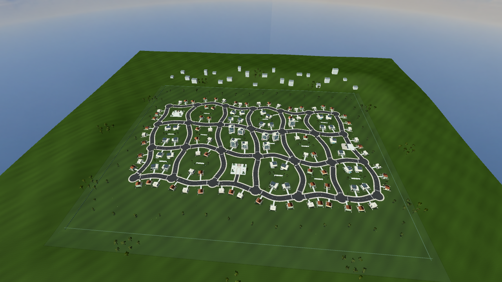

# Bairro ampliado — 9 de outubro de 2026

O usuário pediu triplicar o bairro inicial e deixá-lo mais orgânico antes da próxima melhoria gráfica. A cidade passou de seis para dezoito quarteirões, de 17 para 45 trechos de rua, e de 157.696 para 473.088 m² de terreno físico: 768 × 616 m. O layout continua conectado na mesma cena, com o mesmo carro, câmera e HUD.

[Comparação interativa](compare.html) · [Mapa completo](after/expanded-overview.png) · [Câmera de jogo](after/driving-spawn.png) · [Captura do pacote exportado](package-driving.png) · [Residência](after/residence.png) · [Gol e faróis](after/car-front.png)

Há 115 imóveis, 402 árvores, 56 veículos estacionados e 5.341 tufos de gramíneas, distribuídos em manchas nos espaços livres. A rede viária usa curvas suaves e terreno com vale/encosta. Os dois parques/praças acrescentam destinos e espaço aberto. Calçadas de três metros agora se unem nas esquinas por uma malha contínua, com transições rebaixadas nos cruzamentos e entradas dos imóveis.

As implantações reservam espaço para as construções e seus muros, verificam sobreposição de lotes e deixam como área verde as duas frentes em que uma construção não coube. Fundações amostram o terreno sob toda a casa; muros e jardineiras acompanham o relevo. Gramíneas ficam afastadas das ruas, calçadas e imóveis. Esta inspeção corrige os problemas de implantação observados; não equivale a afirmar ausência de qualquer defeito visual possível.

A carroceria do Gol foi elevada 6 cm em relação às rodas. Pneus, colisão, suspensão física e ajustes de aceleração/condução permanecem os mesmos. A alteração também foi aplicada aos veículos estacionados. O carro comum de todos os mapas agora tem dois feixes de farol e lentes luminosas, ligados por padrão e alternáveis por **L / L1**. Lanternas, luzes de freio e ré continuam independentes.

[Faróis ligados](after/headlights-on.png) · [Faróis desligados](after/headlights-off.png). Estas duas imagens usam iluminação deliberadamente escurecida na ferramenta de inspeção para mostrar os feixes. O jogo conserva sua iluminação de fim de tarde; não foi adicionado ciclo dia/noite.

As capturas usam Compatibility/Equilibrado a 1280 × 720 na AMD R7 M260. `driving-spawn.png` usa a câmera e HUD de jogo, com névoa/culling reais. As demais vistas estáticas desligam névoa e culling para inspecionar a geometria. A comparação `overview` mantém a câmera original, por isso enquadra apenas parte da cidade ampliada; `expanded-overview` mostra o mapa inteiro. As demais vistas seguem os novos pontos de implantação. Imagens e testes funcionais não certificam FPS. Não foi realizado benchmark nesta máquina compartilhada.

A próxima etapa gráfica deve trabalhar o Gol, iluminação, materiais e acabamento de um trecho representativo do bairro ampliado, antes de espalhar esse acabamento. A referência de qualidade continua Most Wanted 2012. Os recursos desta expansão são geometria do próprio projeto; céu e texturas anteriores conservam seus registros de origem.

[Validação e builds](../../../development-results/2026-10-09/pilot-expansion/README.md).
