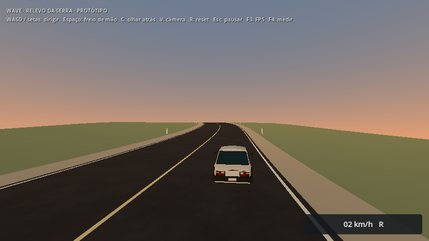
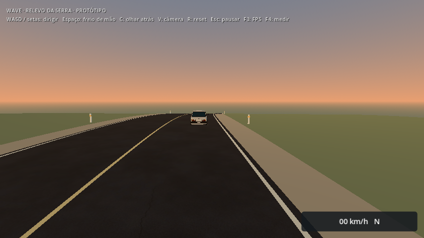
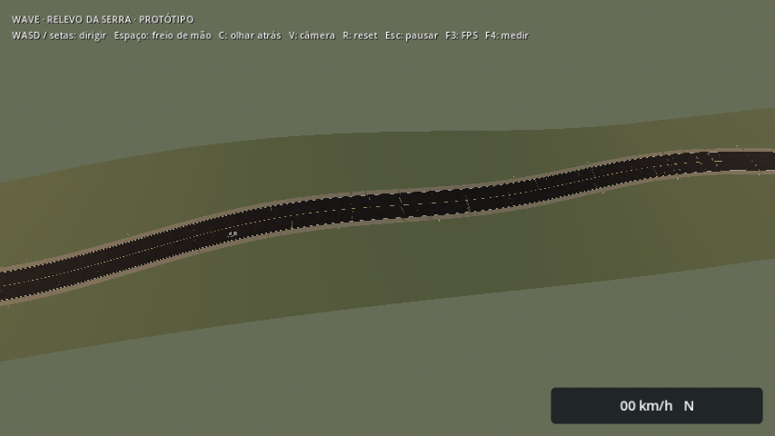
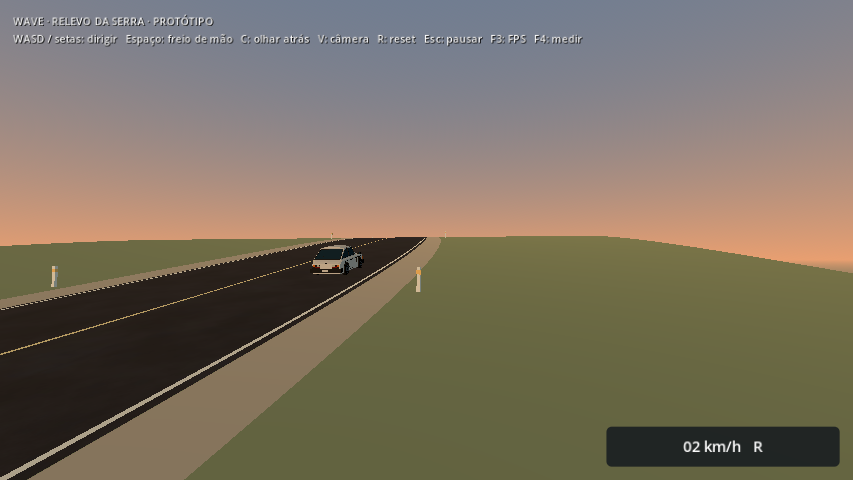

# Curvas e acostamentos no relevo — 2026-10-07

No menu, **Experimentar relevo da serra** continua abrindo o laboratório separado de 800 m. Esta revisão acrescenta duas curvas suaves, acostamentos de 2 m nos dois lados, pintura acompanhando o traçado e balizadores a cada 40 m. O eixo se desloca até 12 m para cada lado, voltando ao centro nas extremidades planas. A estrada conserva 12 m de largura por seção horizontal e a elevação máxima de 18 m.

O asfalto reutiliza `assets/textures/race/asphalt.png`, produzido pelo pipeline existente. Os acostamentos usam uma cor distinta para serem legíveis. Os balizadores são formas simples sem colisão, colocadas fora do acostamento. Nenhuma imagem nova foi gerada. O conteúdo continua sendo uma prova de direção e geometria, sem paisagem de serra final ou integração ao Caminho da Serra.

## Apoio e condução

`elevation_layout.gd` define o eixo compartilhado entre gerador, teleporte e fixture. `road_faces()` produz estrada, acostamentos e pintura na mesma amostragem de 1 m. UVs usam coordenadas globais por z e distância lateral ao eixo, preservando continuidade entre células. A altura física continua dependendo de z, com terreno amplo cobrindo estrada e acostamentos; não há desnível lateral, material físico de cascalho ou mudança na física do carro. O loader, a residência máxima de três células e a guarda de colisão permanecem os mesmos.

A fixture usa pedais e direção analógicos reais para acompanhar o traçado, mede afastamento lateral e verifica contato com o chão em cada passo. O gate da estrada exige afastamento máximo de 1,5 m em relação ao centro da faixa escolhida. O gate dos acostamentos exige que o centro do carro permaneça a menos de 0,9 m do eixo do acostamento de 2 m; isso não exige que toda a carroceria esteja dentro dessa faixa estreita em cada curva.

## Verificação localizada

| Execução | Checks | Resultado |
| --- | ---: | --- |
| Fonte, estrada a 64,8 km/h e acostamentos a 43,2 km/h | 24 | Passou |
| Recursos do PCK, mesma fixture | 24 | Passou |
| Diagnóstico opcional a 108 km/h | 24 | Reprovou dois checks de trajetória |

As verificações incluem regeneração de malhas/normais/UVs/colisões em dados isolados; continuidade de posição e UV nas bordas salvas da estrada, dos acostamentos e da pintura; abertura/saída pelo menu; condução nas curvas em ida/volta; condução nos dois acostamentos através de duas junções e da crista; raios físicos nas três junções; identidade do carro/câmera/HUD; reset, residência, atraso de carga, remoção/restauração da colisão, triângulo ausente e rejeição antes de ativar uma célula sem apoio.

A fixture de 108 km/h completa a ida/volta com contato contínuo e sem holds de streaming, mas o controlador automático não mantém a faixa. Separar direção automática, limite de aderência e condução humana antes de aprovar esse ritmo. Não foi alterada a física do carro para fazer a fixture passar. O runner normal usa 64,8 km/h; `--fast` é diagnóstico opcional e deve continuar retornando falha enquanto seus gates não forem atendidos.

Linux e Windows foram reexportados. Ambos os PCKs têm SHA-256 `3e9d640e3b3e3e5afe8d84b857afb9186b957d2fbcd46dfbc50edde07e5a6ad9`. A conferência do PCK usa a engine Linux e script externo, fora do diretório do projeto; Windows nativo permanece pendente. Logs e hashes de fontes/builds estão nesta pasta. O runner completo não foi repetido; a validação localizada cobre o cenário alterado.

## Prévias









Quatro vistas curtas do mundo real, Econômico 854×480, Compatibility, Radeon R7 M260. Contexto em [context.json](context.json). Sem captura de FPS ou conclusão de desempenho. O registro anterior da pista reta permanece em [elevation](../elevation/README.md).

## Reproduzir

```sh
godot --headless --path . --script scripts/tools/build_elevation.gd
godot --headless --path . --fixed-fps 60 --script tests/elevation_smoke.gd
# Diagnóstico opcional de trajetória, ainda reprovado:
godot --headless --path . --fixed-fps 60 --script tests/elevation_smoke.gd -- --fast
godot --path . --rendering-method gl_compatibility --script scripts/tools/build_elevation_previews.gd
```

Próximo desenvolvimento: direção/câmera em sessão humana e composição de um pequeno recorte com paisagem e referência visual. A integração à viagem exige horizonte/HLOD em altura e ampliação do contrato de apoio. Benchmarks de custo continuam aguardando janela combinada de uso exclusivo da máquina.
