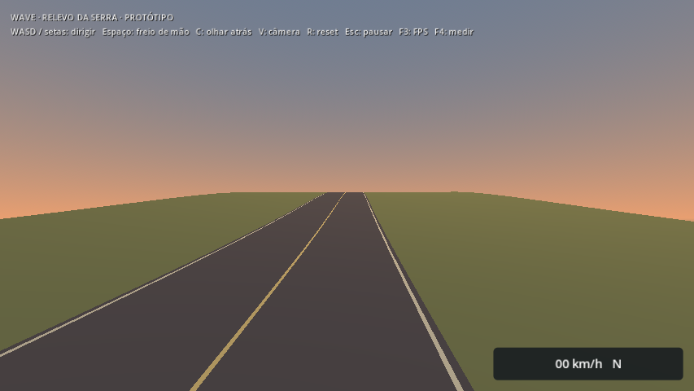
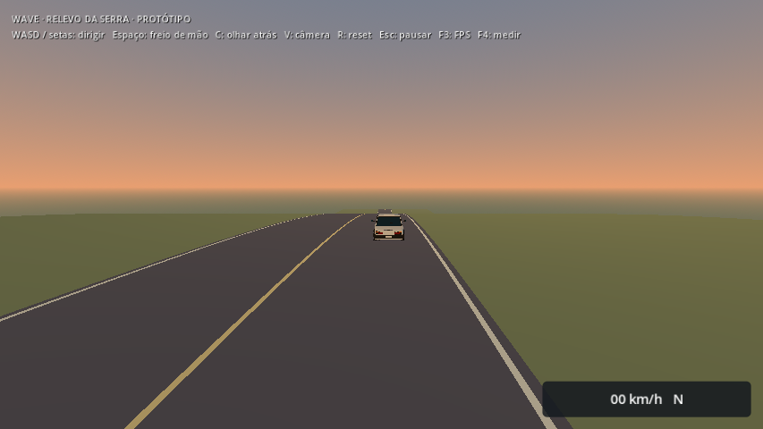
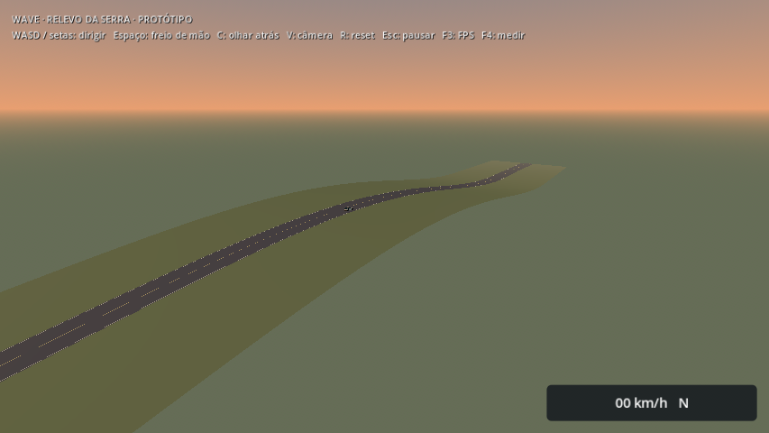

# Prova isolada de relevo — 2026-10-07

Menu: **Experimentar relevo da serra**. A cena `drive_elevation.tscn` tem 800 m, quatro células de 200 m, estrada de 12 m e terreno de 80 m de largura. O perfil sobe de 0 a 18 m e retorna a 0 entre z = −100 e −500; inclinação máxima aproximada de 14,1% (8°). Há espaço lateral nas extremidades planas para retornar; R restaura o spawn. O visual é uma malha simples para avaliar altura, junções e apoio.

## Implementação e resultado

`elevation_streamer.gd` herda seleção, carga por thread, histerese, limite de três residentes, guarda de movimento e drenagem do `WorldStreamer`. A validação de piso plano continua intacta. Esta variante aceita somente a superfície triangulada do perfil deste laboratório, com origem, bounds e transformações exatos; rejeita triângulos ausentes antes de anexar a célula.

A guarda consulta a colisão física sob os quatro cantos previstos do carro, exclui o próprio carro e exige que o corpo atingido pertença a uma célula residente já registrada na física. Desabilitar a colisão interrompe a condução mesmo que o nó da célula permaneça carregado. Não há novo autoload, geração de terreno durante o jogo ou alteração no controlador do carro.

A primeira malha, dividida a cada 4 m, provocou um travamento na subida perto de z = −168. Com segmentos de 1 m, a fixture completou ida/volta a cerca de 18 m/s (65 km/h), mantendo contato e sem bloqueios de segurança na viagem normal. Esse resultado vale para o perfil e a velocidade testados; não certifica terreno arbitrário ou direção a 220 km/h.

## Verificação

| Execução localizada | Checks | Resultado |
| --- | ---: | --- |
| Relevo, recursos fonte | 21 | Passou |
| Streaming plano existente | 28 | Passou |
| Menu existente | 29 | Passou |
| Relevo, recursos do PCK | 21 | Passou |
| Acesso pelo menu do PCK | 13 | Passou |

Os checks de relevo incluem regeneração em dados isolados, comparação de malhas/normais/UVs/colisão, abertura pelo menu, subida/crista/descida com inputs reais, ida/volta sem holds, liberação/recarga, identidade do carro/câmera/HUD, reset, sondagens físicas nas três junções através da largura do terreno, colisão removida/restaurada, triângulo ausente, teleporte elevado com carga atrasada e rejeição de uma célula sem apoio no caminho real de ativação.

Builds Linux e Windows atualizadas. Ambos os PCKs têm SHA-256 `d0b3a9cdff908018d6fc568bd00f90ccb065787b69cd0b67d87a7c786e4d87d9`. O teste do pacote usa a engine Linux como harness e script externo ao PCK, com diretório de trabalho fora do projeto; Windows nativo permanece pendente. Logs nesta pasta. O runner completo não foi repetido nesta revisão; `check_project.sh` inclui agora `elevation_smoke.gd`.

## Prévias







Prévias curtas do mundo real, Econômico 854×480 em Compatibility na Radeon R7 M260. Configuração/câmeras em [context.json](context.json). São vistas fixas de uma prova técnica, sem captura de FPS. Não substituem avaliação humana, benchmark, sessão longa ou aprovação artística.

## Reproduzir

```sh
godot --headless --path . --script scripts/tools/build_elevation.gd
godot --headless --path . --fixed-fps 60 --script tests/elevation_smoke.gd
godot --path . --rendering-method gl_compatibility --script scripts/tools/build_elevation_previews.gd
```

O gerador aceita `-- --output=user://elevation-alternativa`. O teste sempre regenera em dados isolados. Não aplicar os geradores desta prova sobre as células da viagem existente.

Próximo desenvolvimento: avaliar direção/câmera jogando, testar maior velocidade e um recorte com curvas/acostamentos. Depois ampliar o contrato para outros perfis, preparar horizonte/HLOD em altura e integrar uma serra curta ao Caminho da Serra. Tráfego, tarefas, arte final e medições de custo continuam abertos; benchmarks aguardam janela combinada de uso exclusivo da máquina.
