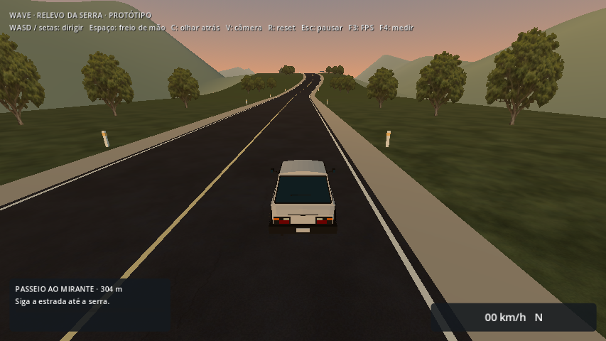
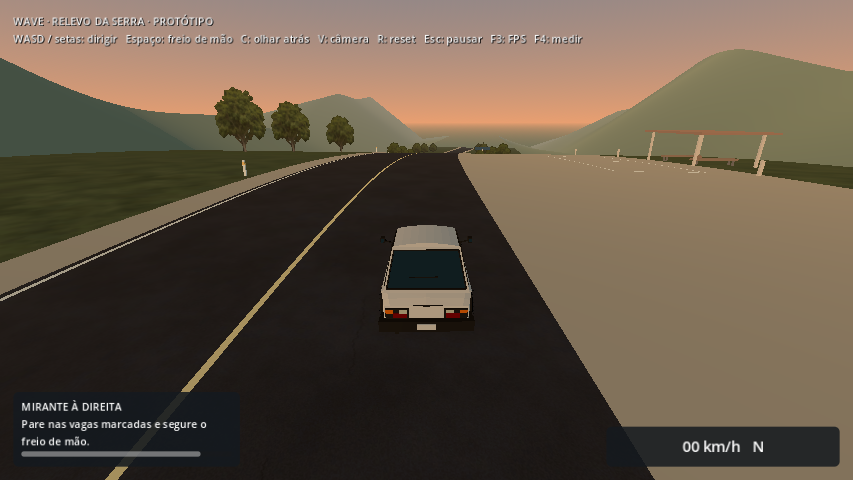
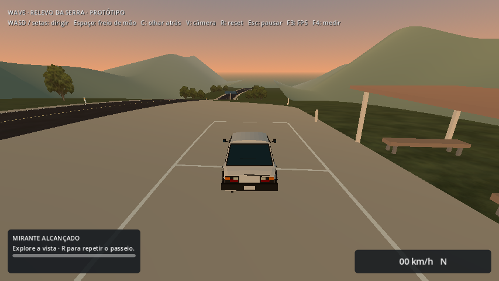

# Passeio ao Mirante — 2026-10-07

Ao abrir **Experimentar relevo da serra**, o HUD apresenta um passeio até o Mirante da Serra. Siga a estrada pela subida, entre à direita junto ao abrigo e pare nas vagas marcadas. Segure o freio de mão (Espaço) para ficar parado. Depois de dois segundos, o HUD confirma a chegada e libera a continuação da exploração. R restaura o carro e inicia outro passeio; o reset pelo menu de pausa faz o mesmo.

## Comportamento

`lookout_trip.gd` é um nó local dessa cena, criado por `elevation_world.gd`, seguindo o padrão de atividades locais dos mapas de corrida/rally. Não modifica o HUD compartilhado, o controlador, o loader ou os mapas anteriores. O painel é inserido antes do menu de pausa, no canto inferior esquerdo, sem sobrepor a telemetria. A atividade começa automaticamente e não impede a exploração livre.

Três passagens ordenadas pela estrada, em z = −100/−200/−280, registram o percurso. São aceitas somente na direção de ida, com apoio registrado, altura compatível e dentro da largura viária. Depois da crista, o HUD indica a entrada do mirante e solicita estacionar. Distância ao destino é uma indicação direta em metros; a barra representa as passagens confirmadas e o tempo final parado.

As vagas acompanham o terreno e delimitam a área de chegada entre z = −324 e −306, a 17–23 m do eixo da estrada. A chegada exige velocidade total de até 2 km/h, contato físico e dois segundos contínuos nessa área. Sair da área, acelerar, perder apoio ou ter o movimento bloqueado reinicia esse tempo. Pausar congela a atividade. Ao completar, a mensagem persiste durante a exploração até o reset ou saída do mapa.

Saltos de posição cancelam o passeio até o próximo reset. `teleport_to()` também cancela explicitamente a atividade, preservando os teleportes usados nas ferramentas de diagnóstico. Ir diretamente ao estacionamento não concede chegada. Dirigir por fora da estrada não pula uma passagem pendente.

O estado vale somente na sessão atual: retornar ao menu e reabrir o mapa inicia outro passeio. Não há persistência ou recorde de tempo nesta atividade. A pista continua separada do Caminho da Serra; a validação anterior de trajetória a 108 km/h permanece aberta.

## Verificação localizada

| Execução | Checks | Resultado |
| --- | ---: | --- |
| Passeio, recursos fonte | 18 | Passou |
| Relevo e regeneração com vagas demarcadas | 26 | Passou |
| Acesso ao mirante com a atividade integrada | 7 | Passou |
| Passeio, recursos do PCK | 18 | Passou |

A fixture dirige com inputs reais desde o spawn, atravessa a subida, reduz a velocidade e entra nas vagas. Verifica progresso ordenado, chegada apenas ao parar, pausa, colisão removida/restaurada durante a chegada, persistência da conclusão na exploração, R, reset pelo menu, salto direto ao destino, condução fora da estrada, liberação ao sair do mapa e nova sessão. O painel é conferido no perfil Econômico, sem sobrepor o velocímetro. A suíte de relevo continua verificando regeneração, geometria/UVs/colisões, ida/volta a 64,8 km/h, acostamentos, junções, residência, atraso e falhas.

O runner completo não foi repetido nesta revisão; `check_project.sh` inclui agora `lookout_trip_smoke.gd`. Logs finais nesta pasta. A conferência do PCK usa scripts externos, engine Linux e diretório fora do projeto, exigindo `project.binary` e ausência de `project.godot`. Windows nativo permanece pendente. As builds Linux/Windows foram reexportadas; identidades em [identities.json](identities.json).

## Prévias do HUD







São três estados de interface montados pela ferramenta de prévias, com poses fixas no mundo real. As regras de chegada são verificadas separadamente pela fixture de condução headless. Perfil Econômico 854×480, Compatibility, Radeon R7 M260; contexto em [context.json](context.json). Sem captura de FPS ou conclusão de custo; benchmarks continuam aguardando uma janela combinada de uso exclusivo da máquina.

## Reproduzir

```sh
godot --headless --path . --fixed-fps 60 --script tests/lookout_trip_smoke.gd
godot --headless --path . --fixed-fps 60 --script tests/elevation_smoke.gd
godot --path . --rendering-method gl_compatibility --script scripts/tools/build_lookout_trip_previews.gd
```

O teste também aceita `-- --previews --output=...` com janela para capturar os estados durante a própria condução funcional; isso não é um benchmark. Próximos passos: avaliar o passeio jogando e desenvolver retorno ou outro destino, mantendo a integração do relevo à viagem para uma etapa com contrato de apoio e horizonte/HLOD apropriados.
