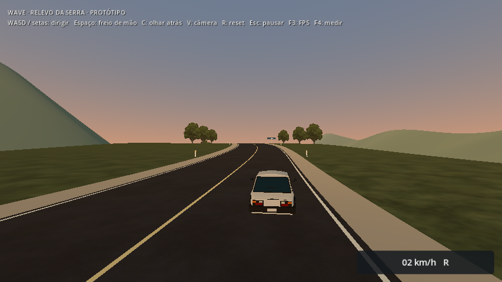
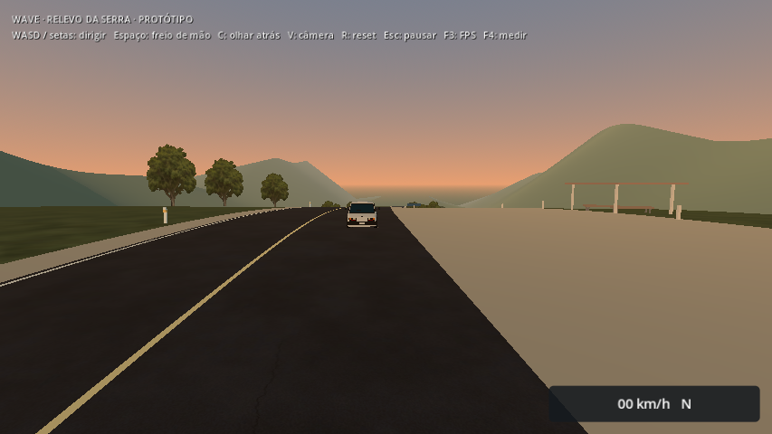
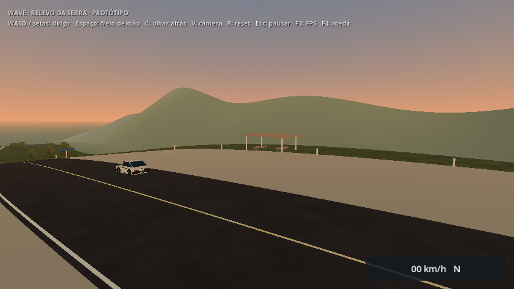
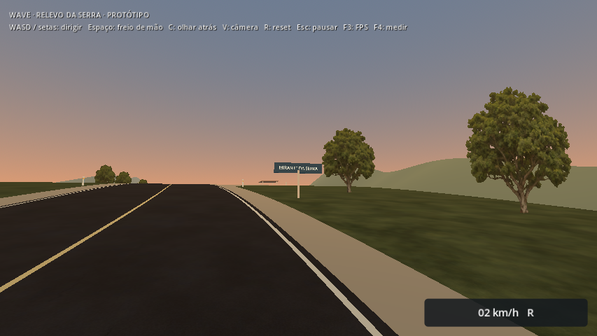
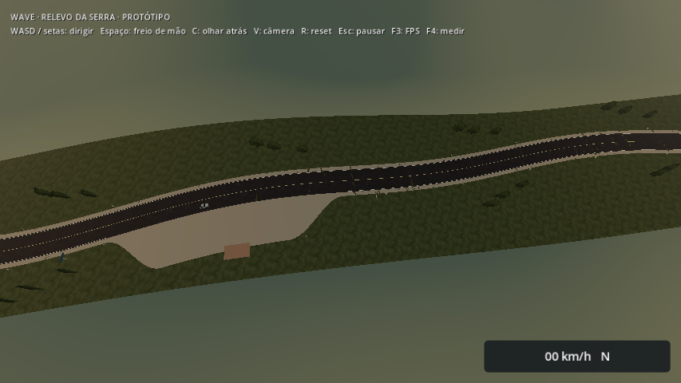

# Paisagem e Mirante da Serra — 2026-10-07

Menu: **Experimentar relevo da serra**. O laboratório de 800 m recebeu morros no horizonte, chão com textura de grama, 45 árvores em grupos e uma parada perto da crista. Na ida, a placa anuncia o **Mirante da Serra**, à direita, com entrada ampla, abrigo e dois bancos. A parada fica em torno de z = −315 m; sua área de acesso acompanha o relevo e se abre gradualmente entre z = −260 e −360. A sinalização também é voltada a quem retorna.

A entrada remove os balizadores e a pintura de borda do lado direito nesse intervalo. O abrigo, bancos, pilares e postes ficam além do centro da área de estacionamento. Os pilares têm comprimentos diferentes para ligar o terreno inclinado à cobertura horizontal. Essa revisão acrescenta um ponto de referência ao percurso; ainda não há uma atividade ou recompensa no mirante.

## Autoria e streaming

`elevation_scenery.gd` gera a paisagem offline junto com `elevation_builder.gd`. Os dois meshes do horizonte têm 3.000 triângulos ao todo, ficam fora da área de apoio e não possuem colisão. Vegetação e mobiliário pertencem às células e seguem sua carga/liberação. As árvores usam o PNG já existente do corredor, alpha scissor e billboard em torno de Y. Suas posições são preservadas por `BakedMultiMesh`, incluindo bounds para rotação dos cards. Troncos e mobiliário têm colisão simples.

Grama, asfalto e árvore reutilizam assets existentes, sem mudar seus arquivos de imagem. Placas usam geometria e `Label3D` com fonte padrão da engine. Não houve download, nova imagem por IA, novo autoload ou alteração da física do carro. O piso de apoio, curvas, alturas, preload/histerese e limite de três células continuam os mesmos. A área da parada é visual sobre a malha de apoio existente, sem degrau físico.

O horizonte permanece residente neste laboratório pequeno. Não é uma solução de HLOD para todo o território. A paisagem continua provisória, com materiais simples e vegetação em cards; composição em movimento e aprovação humana ainda precisam de avaliação. A serra continua separada do Caminho da Serra.

## Verificação localizada

| Execução | Checks | Resultado |
| --- | ---: | --- |
| Relevo, recursos fonte | 26 | Passou |
| Acesso ao mirante, recursos fonte | 7 | Passou |
| Relevo, recursos do PCK | 26 | Passou |
| Acesso ao mirante, recursos do PCK | 7 | Passou |

O teste de relevo mantém a viagem em ida/volta a 64,8 km/h, condução pelos acostamentos a 43,2 km/h, apoio físico nas junções, residência, reset, atraso e falhas. Agora também compara a regeneração do horizonte e verifica que as posições das árvores sobrevivem ao salvamento headless. O acesso ao mirante usa inputs reais para atravessar a abertura em ambos os sentidos, mantendo contato e sem holds; sonda colisão de um pilar e confirma que a paisagem distante não autoriza dirigir fora dos bounds de apoio.

Logs finais nesta pasta. As advertências de célula sem apoio são esperadas no teste de falha. O runner completo não foi repetido; `check_project.sh` inclui as duas suites. O diagnóstico anterior a 108 km/h continua reprovado por trajetória na faixa e não foi repetido nesta revisão de paisagem. Não há conclusão nova de desempenho; benchmarks aguardam janela combinada de uso exclusivo da máquina.

Builds Linux e Windows reexportados, PCK idêntico com SHA-256 `8c5934aaa73241f9ea2dbf2e136e58df97671c3a9c719d57560634bb8980833d`. Testes do pacote usam a engine Linux como harness, scripts externos ao PCK e diretório fora do projeto. Windows nativo permanece pendente. Hashes de fontes, células e builds em [identities.json](identities.json).

## Prévias











Capturas curtas do mundo real, Econômico 854×480, Compatibility, Radeon R7 M260. Câmeras/configuração em [context.json](context.json). Não são capturas de FPS. A [pista reta](../elevation/README.md) e a [revisão de curvas/acostamentos](../elevation-curves/README.md) continuam documentadas como histórico.

## Reproduzir

```sh
godot --headless --path . --script scripts/tools/build_elevation.gd
godot --headless --path . --fixed-fps 60 --script tests/elevation_smoke.gd
godot --headless --path . --fixed-fps 60 --script tests/elevation_access_smoke.gd
godot --path . --rendering-method gl_compatibility --script scripts/tools/build_elevation_previews.gd
```

O gerador aceita `-- --output=user://serra-alternativa`; os testes regeneram em dados isolados. Próximos passos: avaliar a parada e a paisagem em movimento, refinar os enquadramentos fracos e preparar continuidade de apoio/horizonte antes de integrar um trecho de serra à viagem.
