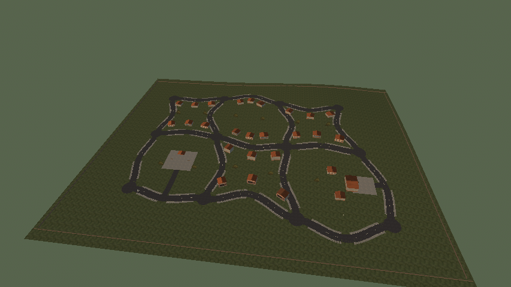
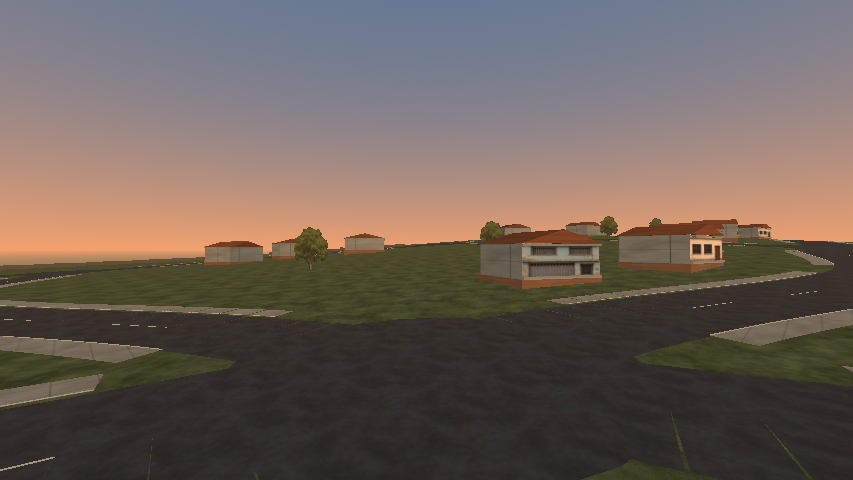

# Cidade piloto — primeiro bairro

2026-10-08. Primeiro incremento da nova direção: uma cidade pequena e conectada para definir condução e estética antes das cidades definitivas. **Seis quarteirões entregues; cerca de quinze continuam sendo a meta.**

A primeira opção do menu, **Dirigir na cidade piloto**, abre a cena compacta gerada offline. Dezessete ruas conectam doze cruzamentos, com curvas individuais, calçadas e terreno em altura. Praça na parte baixa, casas na encosta e oficina com pátio são os primeiros usos do território. Materiais, casas, árvores, carro, câmera, HUD e luz reaproveitam a base existente. A física arcade permanece a mesma.






`driving-spawn.png` usa a câmera real e HUD em Econômico/854×480. As outras imagens usam câmeras estáticas, com neblina e culling por distância desativados para inspecionar o conjunto. `context.json` registra a R7 M260 e as vistas. Essas capturas não são benchmark nem aprovação artística.

## Verificação funcional

A fixture da cidade passou **31 checks sem falhas**, com desnível de **13,48 m** entre as ruas amostradas. No PCK, a cidade passou **29 checks** (somente os dois de geração offline são omitidos); o runner de acessos passou **203 checks**, incluindo a cidade. O menu do PCK passou **17 checks**; o executável Linux também abriu em headless. Os seis percursos tiveram apoio em todos os quadros amostrados e pelo menos 99,1% das consultas sobre pavimento.

A fixture `tests/pilot_city_smoke.gd` verifica conectividade, regeneração idêntica de meshes/UVs/colisões/lotes, menu, spawn/reset, apoio nas dezessete ruas e relevo. Dirige três circuitos nos dois sentidos, com comandos reais, mantendo carro/câmera/HUD. As curvas da rota de referência são arredondadas dentro dos cruzamentos; há redução de velocidade nas aproximações. Mede apoio e pavimento sob o carro, além de entrada/saída da praça e oficina, pausa e retorno ao menu.

A validação do projeto completou **635 checks de comportamento e dez testes Python**, em duas etapas. A primeira passagem encontrou uma suposição antiga no teste de streaming: Enter abriria a avenida como opção padrão. A fixture agora seleciona explicitamente a avenida antes de Enter; streaming e as suites restantes foram executados novamente e passaram. `project-check-initial.log` preserva a falha, `project-check-resumed.log` registra a retomada e `project-validation.log` reúne as verificações aprovadas sem duplicar as etapas.

O runner inclui a cidade e preserva os laboratórios anteriores. A fixture exportada usa recursos do PCK, pula somente a regeneração offline e mantém as verificações de condução. Logs e resultados anexados registram a execução desta versão. `artifact-hashes.json` identifica scripts, cenas e os PCKs Linux/Windows, que têm o mesmo SHA-256. Windows nativo não foi executado.

## Limites e próxima revisão

Este é um traçado inicial com arte provisória. Faltam densidade urbana, acabamento de fachadas/lotes, composição do horizonte e direção visual aprovada. Primeiro avaliar jogando o contorno, centro e encosta; corrigir escala, cruzamentos e sensação. Depois detalhar um quarteirão nesta cidade e estender o traçado até aproximadamente quinze, conforme o [plano](../../../../development-plan.md).

A cena carrega inteira. Não há tráfego nem atividade nova. Testes headless não comprovam diversão, desempenho gráfico, gamepad ou Windows nativo. As metas HD 4400/R7 M260 e 8 GB continuam abertas. Não foram feitas alterações de física para aprovar a fixture. A fixture da cidade emite um aviso de seis instâncias ObjectDB ao encerrar, como outras fixtures históricas; a validação funcional não comprova ausência de vazamento.

## Reproduzir

```sh
GODOT_BIN=~/Downloads/Apps/Godot_v4.7.2-stable_linux.x86_64 bash scripts/tools/check_project.sh
GODOT_BIN=~/Downloads/Apps/Godot_v4.7.2-stable_linux.x86_64 bash scripts/tools/check_exported_access.sh
```

Para dirigir, executar `builds/linux/Wave.x86_64` ou `builds/windows/Wave.exe` e escolher a primeira opção do menu. W/S aceleram e freiam, A/D viram, Espaço aciona o freio de mão, V troca a câmera, R reinicia e Esc pausa.
